# BRDF

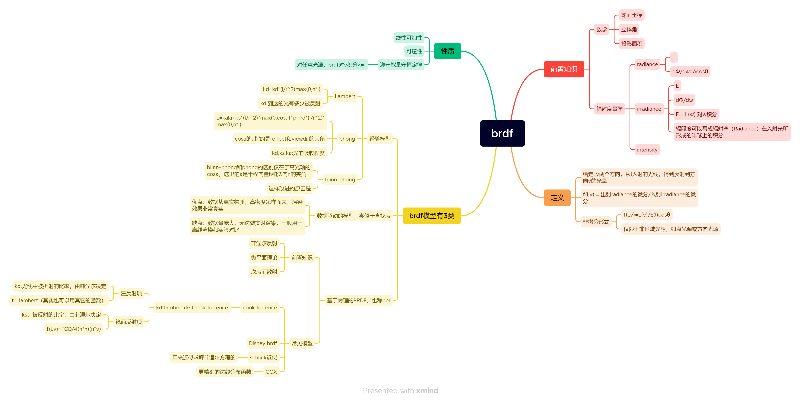

前置知识部分跳过，网上有很多。BRDF的经验模型在其它部分讲解，我们先直接来看**基于物理的BRDF**。

先来看看没有自发光项的渲染方程：$L_o(\omega_o)=\int_{H^2}f_r(\omega_o,\omega_i)L_i(\omega_i)cos\theta_id\omega_i$

$L_i(\omega_i)cos\theta_i$项是shading point接到的光，$f_r$指的是在shading point ，从$\omega_i$方向射过来的光有百分之多少从$\omega_o$射出去。因为对$\omega_o$产生贡献的光是从四面八方照射过来的，因此要对$\omega_i$在半球上积分，这就是渲染方程。

BRDF计算的就是$f_r$项，总的来说，**BRDF决定了一个物体的材质！**

BRDF的定义：irradiance的微分/radiance的微分。对于一个shading point周围一片很小的区域(个人认为可以理解成一颗像素覆盖的区域)接收到的光称为irradiance，BRDF遵循能量守恒定律

### Diffuse/Lambertian Material

计算一个**光在各个角度都恒定**且**理想漫反射表面**的BRDF：

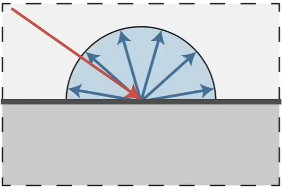

光在各个角度恒定，**不管从哪个方向入射能量都一样**，$L_i(\omega_i)=C_1$ 。理想漫反射表面，光被均匀的反射到每一个方向而且这个表面不会吸收光，也就是说，**不管从哪个方向出射能量都一样**，因此$f_r=C_2$（还记得$f_r$的定义吗）。所以，渲染方程为$L_o(\omega_o)=f_rL_i\int_{H^2}cos\theta_id\omega_i$，$cos\theta_i$指的是入射光与法线的夹角，刚好等于空间中的俯仰角，我们用球坐标把式子拆成二重积分$\int_{H^2}cos\theta_id\omega_i=\int_{2\pi}\int_{\frac{\pi}{2}}cos\theta_id\theta_i=\pi$

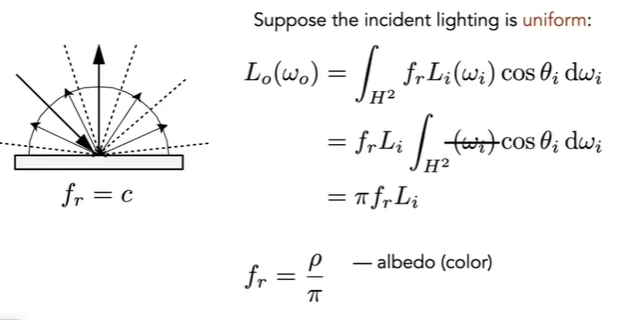

所以原本的式子$L_o(\omega_o)=f_rL_i\pi$ ；根据能量守恒定律，进来多少irradiance就得出去多少irradiance，而且理想漫反射表面是不会吸收能量的，所以$L_o=L_i$

可推知 4  $f_r\pi=1$ 所以$f_r=\frac{1}{\pi}$。这里可以加一个albedo：颜色值

### glossy Material

定义：很像镜面反射，但又不是完全镜面，比镜面要粗糙一些。**就是抛光了的金属**。

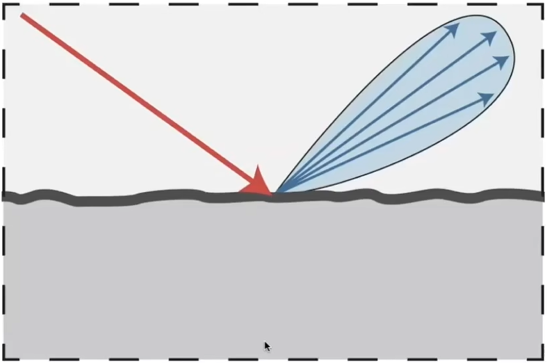

不同的材质表现出来的性质也不相同。

### 理想的反射/折射材质(BSDF*)

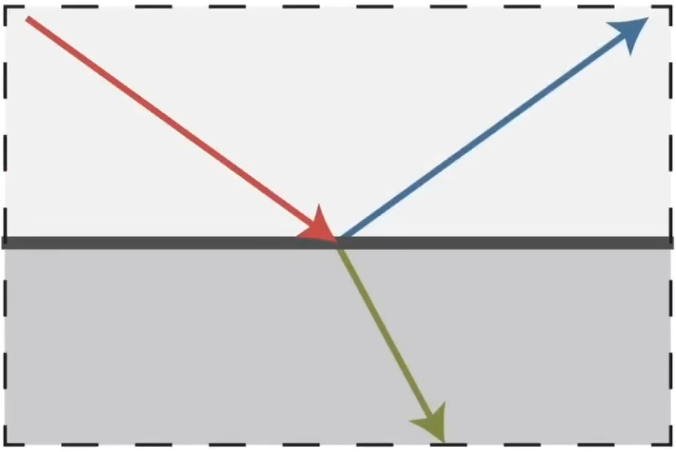

会出现以上这种反射/折射现象的是玻璃或者水

上图左边就是普通的反射 和 折射，反射使得球壳表面能看到窗外的倒影，折射使得光线能透过球壳打到里面的灰色材质；右边的反射和左边的相同，折射不同，原因是这个球壳是有颜色的，颜色的来源是折射进入球壳的光线被部分吸收，如果是完全吸收那么球壳就是黑的了。有一部分被吸收，另一部分仍在往前传播，那就显示出了颜色。

### 给定法线和入射方向，求出射方向

有两种求解方法。

法一：

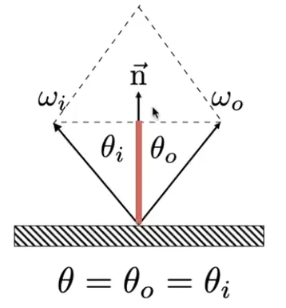

$\omega_i+\omega_o=n$；$\omega_i$在$n$上的投影$(\omega_i·n)n$就是图中红线的部分，它刚好等于$\frac{1}{2}(\omega_i+\omega_o)$

所以有$\omega_o=-\omega_i+2(\omega_i·n)n$

可以看到计算这个反射方向并不是那么简单，要算点乘还要算加法。所以我们一般计算**半程向量**来得更容易一些

法二：利用球面坐标下向量的方向角和俯仰角。

由法一我们知道$\omega_i$和$\omega_o$的俯仰角相同。那么现在只需求$\omega_o$的方向角即可。其实这很简单，我们从上往下看shading point所在的平面

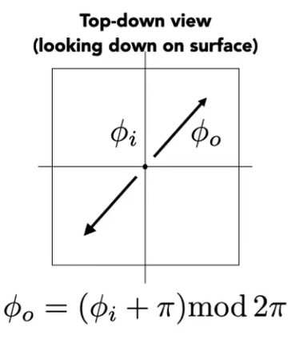

### 理想镜面反射BRDF

要写对这个BRDF并不是那么简单，具体可以看看PBRT这本书。

### 折射——Snell's Law

焦散

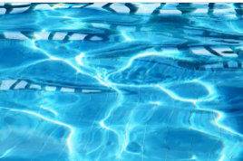

有一种波光粼粼的效果，计算机上很难做到，而且**不适合用path tracing**

Snell's Law

根据**入射光所在介质的折射率**和**出射光所在介质的折射率**，可以计算出折射光线与法线的夹角。这就是Snell定律！

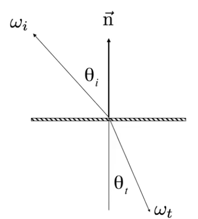

$\eta_isin\theta_i=\eta_tsin\theta_t$

空气的折射率是1；水的折射率是1.3333；玻璃的折射率是1.5-1.6；钻石的折射率是2.42。可以看到钻石的折射率非常的高，当光从空气进入钻石，光线会被折射得非常厉害，这也就是钻石为什么那么闪耀的原因。

 对上式进行处理，可以得到

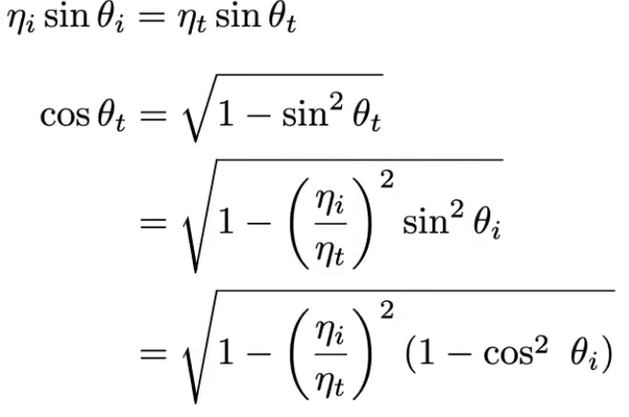

当$cos\theta_t$得不到一个有意义的实数时，折射就不会发生，也就是当$1-(\frac{\eta_i}{\eta_t})^2(1-cos^2\theta_i)<0$时，化简之后，也就是$\eta_i>\eta_t$时。也就是光从折射率比较大的介质进入了折射率比较小的介质时，有可能出现没有折射的现象，这就叫**全反射现象！**

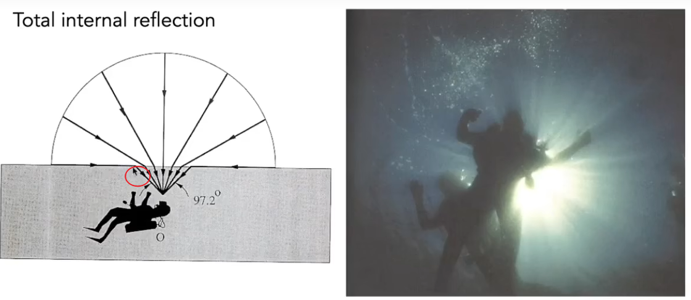

人在水底往各个方向去看，最多只能看到一个锥形的区域。因为根据左边这个图，当人往图中圈出来的哪个方向去看的时候，光线往平的方向去了，如果这个角度再大一点，所有能量都会反射到池子地下那就看不见了，这就是为什么右边的图会周围有一圈黑的。

我们之前在path tracing一个球的时候，**因为球有很好的对称性质**，所有进入球的光都会被折射出去(这一点本人暂时没搞懂)，入射点和出射点有很明显的对称性质。

BRDF表示反射，R是reflect的意思。表示折射用BTDF，T是transmit的意思。**BTDF+BRDF=BSDF**，S是scatter的意思，表示散射，反射和折射都能看作一种散射。

### Fresnel Reflection/Term 菲涅尔项

既然一个光照到一个物体上，部分被反射部分被折射，那么反射部分和折射部分分别占多少呢？这就涉及到菲涅尔定律了。反射部分的比例和入射光的角度有关。当入射光接近于法线的时候折射部分较多，当入射光和法线夹角接近90度的时候，也就是grazing angle，反射部分较多。

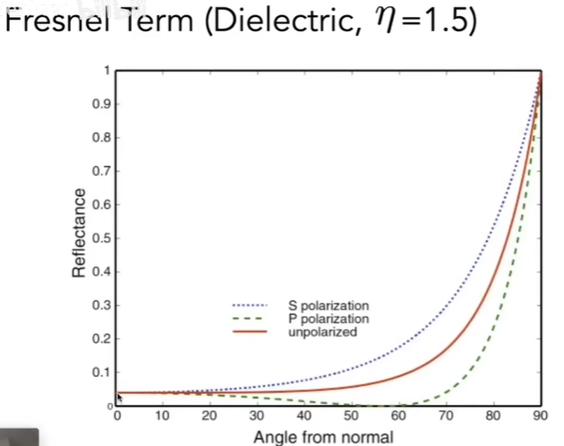

两条虚线指的是极化，只看红实线就行。x轴表示入射光和法线的夹角，y轴表示有多少被反射。可见当夹角接近grazing angle的时候，反射急剧增加到1。

导体的菲涅尔项又不一样了，导体的折射率是复数，绝缘体的折射率是实数。

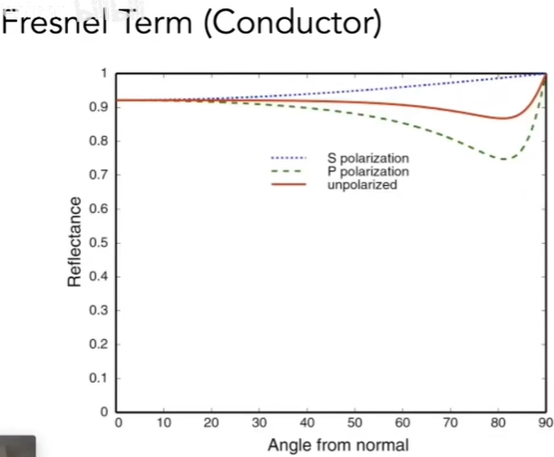

金属的菲涅尔项，当垂直观看表面的时候，也就是入射光和法线夹角较小的时候，被反射的部分也非常多。这就是为什么古代镜子用铜镜的原因。

菲涅尔项的计算方法：用schlick’s近似

$R(\theta)=R_0+(1-R_0)(1-cos\theta)^5$，$R_0=(\frac{n_1-n_2}{n_1+n_2})^2$

$R_0$表示的是$R(0)$，这个式子近似表达了菲涅尔项从$R_0$增长到1的过程。

### 微表面理论

（这里不会详细讲解）

微表面理论的关键是：**微表面法线的分布**

微表面法线就在表面法线周围的一个小区域内有分布，表面看起来相对光滑，对应的是glossy的材质。

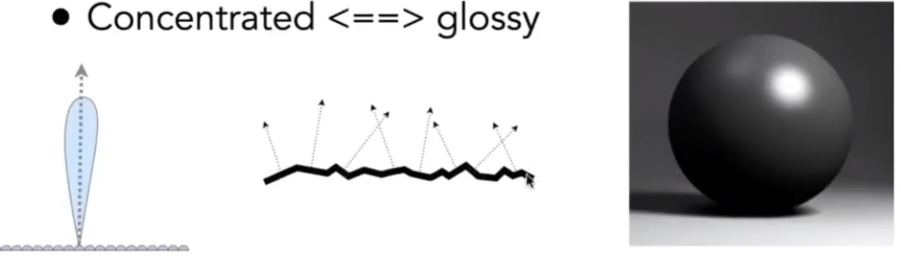

当微表面法线分布得很开，各个朝向的微表面都有，材质就会看起来比较粗糙，对应的是diffuse的材质。

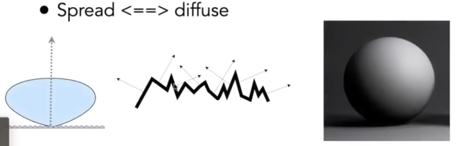

所以，**表面的粗糙程度可以用微表面法线分布来表示。**

### 微表面的BRDF

菲涅尔项：有多少被反射。先定好能量

法线分布项：入射方向i过来的光，有多少能被反射到方向o上面去。根据之前的知识，**参数只需传入半程向量h**，微表面法线有多少等于h，那就有多少光能被反射到方向o

几何项G项：光线从方向i过来，有一部分可能被遮挡；光线从方向o反射出去，也有一部分可能被遮挡。因此我们需要一个遮蔽项来确定有多少能量不被遮挡。显然，当光线几乎垂直表面法线打过来时，有很大一部分会被遮挡；同理，观察方向接近grazing angle的时候，也会有很大一部分被遮挡。所以G项的参数需要i,o,h。几何项是用来修正grazing angle比较亮的问题的。

**总结：光如何反射，决定性因素是法线是集中还是发散，也就是法线分布项**

### 各项同性与各项异性BRDF

各项同性的在公式上的意思是，$f_r(\theta_i,\phi_i;\theta_r,\phi_r)= f_r(\theta_i,\theta_r,\phi_r-\phi_i)$从4维降到3维。

同理，各向异性的意思就是$f_r(\theta_i,\phi_i;\theta_r,\phi_r)\neq f_r(\theta_i,\theta_r,\phi_r-\phi_i)$

### BRDF的性质

- 非负性
  - $f_r(\omega_i\rightarrow\omega_r)>0$
- 线性性
  - 可加性
- 可逆性
  - $f_r(\omega_i\rightarrow\omega_r)=f_r(\omega_r\rightarrow\omega_i)$
- 能量守恒
  - $\forall\omega_r\int_{H^2}f_r(\omega_i\rightarrow\omega_r)\cos\theta_id\omega_i\leq1$

### BRDF测量

前面提到过BRDF是四维的$f_r(\theta_i,\phi_i;\theta_r,\phi_r)$，那么测量BRDF最直接的方法就是先固定一个光源，让相机在半球上走一遍；再挪动一下光源，让相机在半球上走一遍，直到光源走遍了整个半球。

听起来就数据量很大，一个简化方法是对于各项同性材质，$(\theta_i,\theta_r,\phi_r-\phi_i)$数据维数降到了三维。

再利用光路的可逆性，相机光源只需走半球的一半

等等。。。还有很多优化BRDF测量的方法，过于复杂这里就不展开。