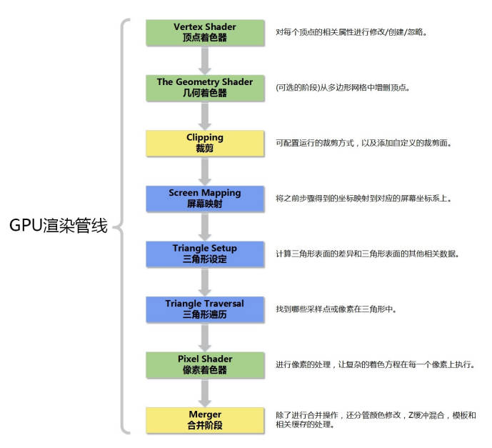

# GPU渲染管线

绿色：完全可编程阶段；黄色：高度可配置阶段；蓝色：不可编程不可配置阶段

## 曲面细分着色器：

why：三角网格精度不够的情况下需要对三角面进行细分来增加细节。

优点：

1. 可以借助曲面细分来实现细节层次的机制：离相机越近的物体具有更加丰富的细节，这样对于远距离的物体不用消耗过多的存储。
2. 可以减少模型的存储量，有曲面细分技术，我们可以在硬盘上存储低精度的网格，当网格输入渲染管线之后再进行曲面细分。

what：利用镶嵌化技术，是渲染管线的一个可选阶段，由外壳着色器、镶嵌器和域着色器组成。

------

## 几何着色器

why：几何着色器可以将输入的图元扩充成多边形，或是什么都不输出。其亮点就是可以创建或销毁几何图元

what：管线的可选阶段，在曲面细分着色器之后光栅化之前。

应用：法线可视化，动态几何体，公告牌
