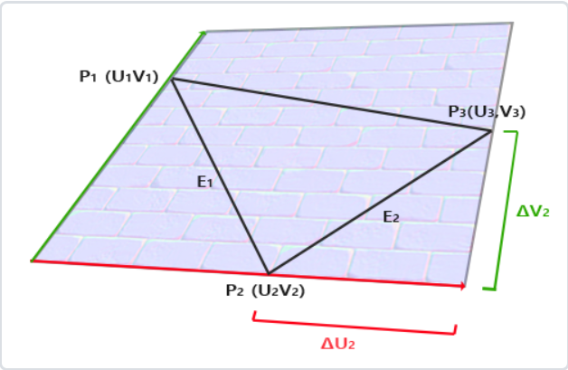
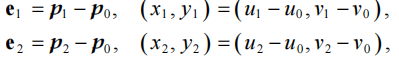
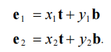
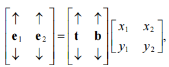
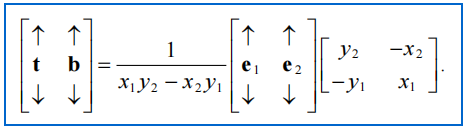
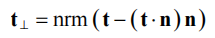
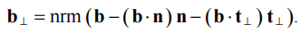
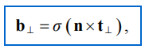

# Tangent Space

why：法线贴图中的法线是定义在局部坐标系中的，法线贴图给模型增加了细节。比如当没有法线贴图的时候，三角形内部的片段法线是插值而来的，整体看起来就比较光滑，没什么细节。用了法线贴图之后，每个片段可以人为的设置一个法线，以产生不同的光照效果。很显然，我们希望法线贴图中的法线是相对于三角形法线静止的，而不是当三角形发生翻转的时候，法线贴图中的法线还原地不动，所以我们将其定义在局部坐标系，也就是每一个三角形所在的面是xoy面，法线是z轴的坐标系。由此引出tangent space！

what：几乎所有的局部坐标系都称为tangent space。z轴是法线，t轴对应纹理的u轴，b对应纹理的v轴。每个顶点都有自己的tbn，光栅化插值到片段着色器之后每个片段都有自己的tbn，法线就定义在这个tbn中。计算所需原料：三角形三个顶点的position和纹理坐标

how：这里讲述t和b如何计算。

顶点的纹理坐标和position一一对应

$p_0=u_0t+v_0b$；$p_1=u_1t+v_1b$；$p_2=u_2t+v_2b$；

所以$p_1-p_0=(u_1-u_0)t+(v_1-v_0)b$；$p_2-p_0=(u_2-u_0)t+(v_2-v_0)b$

写成矩阵的形式就是

把最右边的矩阵求逆挪到等号左边，有

$e_1,e_2$是顶点的position。这样就能求出t和b了。

然而 这样求出的t和b是单个三角形的。我们知道一个顶点可能会被很多个三角形复用，顶点的法线是由这些三角形的法线加权平均而来，所以法线很可能并不垂直单一平面。所以要对t做施密特正交化，让t去垂直于n。

也由施密特正交化，去处理b

这样tbn就求解完毕了。

与实际应用不同的是，每个顶点我们往往只记录t和n，b用叉乘计算出来。但是tangent space可以是左手系也可以是右手系，怎么判断呢？答案是提前计算矩阵[t,b,n]的行列式的符号，并放在n或者t的w分量带过来，顶点着色器中b的计算如下：

