# mipmap

why：mipmap是用来解决纹理过大带来的问题。纹理过大，一颗像素会覆盖纹理上的一片纹素，一个像素里面的颜色信息是高频变化的，那么这个像素取什么值呢？如果我们仅仅用像素中心求纹理坐标，采样后就写回像素，会发生下面的问题。

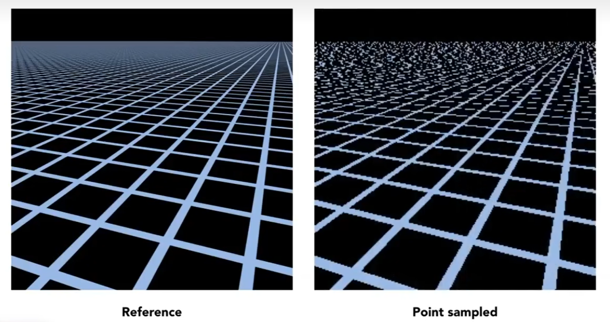

近处产生锯齿，远处产生摩尔纹。**解决走样的问题关键在于计算像素覆盖的那一片纹理的平均值。**

既然走样是因为采样率不足导致，那么我们使用超采样呢？一个像素内部有512个采样点，把512次采样的结果求平均，得到的效果如下：

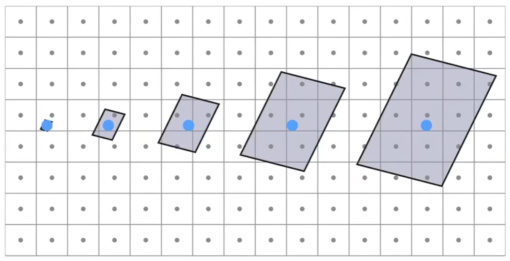

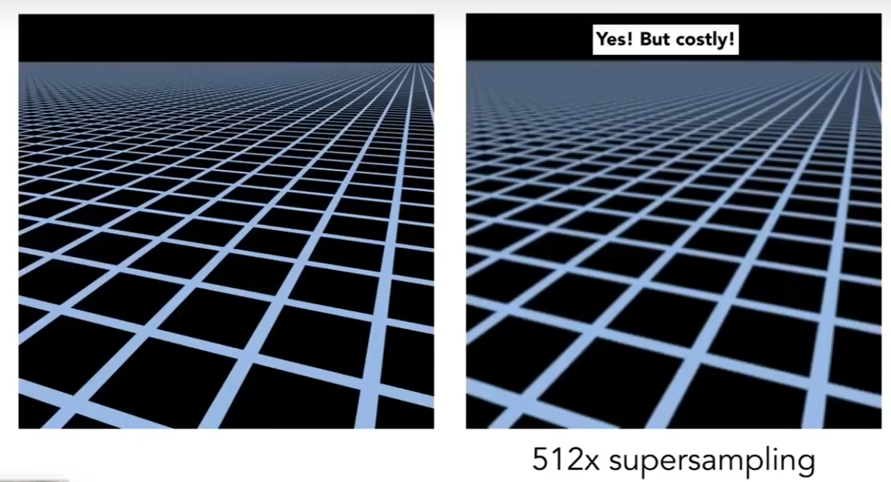

效果很好，但是性能消耗太高了！

采样会引起走样，那我们不采样，则只需要得到像素对应的footprint的平均值，footprint近似是个平行四边形，且边平行于$u_x=(du/dx,dv/dx)$ $u_y=(du/dy,dv/dy)$。给定任何一个区域，要得到该区域颜色平均值的问题，称为范围查询。

一个场景，有近处的物体也有远处的物体，假设它们都用同一个纹理。近处的物体大，一个像素覆盖的纹理区域小；远处的物体小，一个像素覆盖的纹理区域大。因此，范围查询应该能查询任意不同的大小。所以引入mipmap！

**mipmap只允许“近似的”，“正方形”的查询。mipmap查询很快**

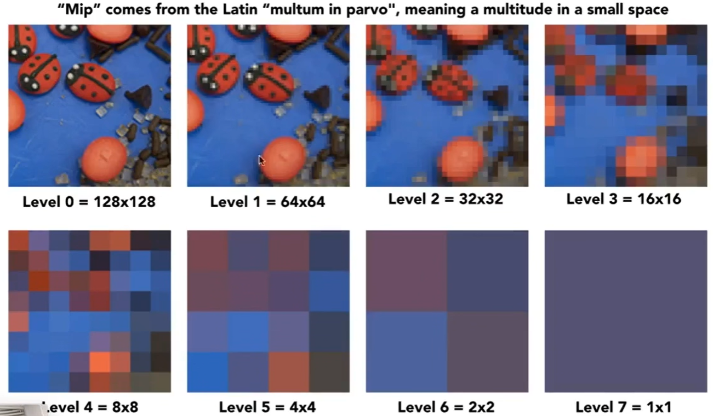

所有层级的mipmap存储空间是$\frac{4}{3}$, 级数求和 $1+\frac{1}{4}+\frac{1}{4^2}+\frac{1}{4^3}+\frac{1}{4^4}+……$，所以mipmap只需要额外原本的$\frac{1}{3}$

任何一个像素，可以映射到纹理上的一个区域，称为footprint，根据footprint的大小确定texture的level。方法如下：

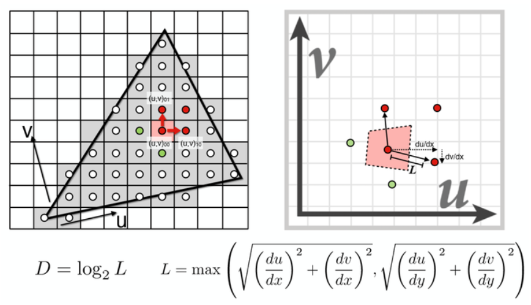

在屏幕空间中取当前像素点的右方和上方的两个相邻像素点，分别查询得到这3个点对应在Texture space的坐标，计算出当前像素点与右方像素点和上方像素点在Texture space的距离，二者取最大值L，把footprint近似成边长为L的正方形。level D = $log_2L$，有了层数之后，再用纹理坐标去那一层查询就可以找到footprint的平均值了。

D是连续的，不是一个整数，有两种解决方法，第一种是四舍五入近似到整数，做可视化效果如下，颜色越深D越小，

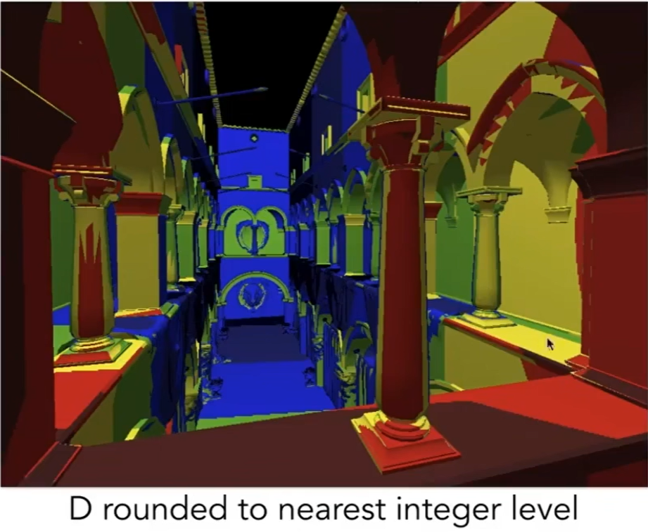

可以看到有一个问题，这个变化不怎么连续。怎么解决？？插值！用插值获得D.XX层的mipmap，方法：用三线性插值！最后一步是层与层之间的插值

1. 在D层找到周围4个点做双线性插值
2. 在D+1层做同样的双线性插值
3. 得到的两个值再做一次线性插值

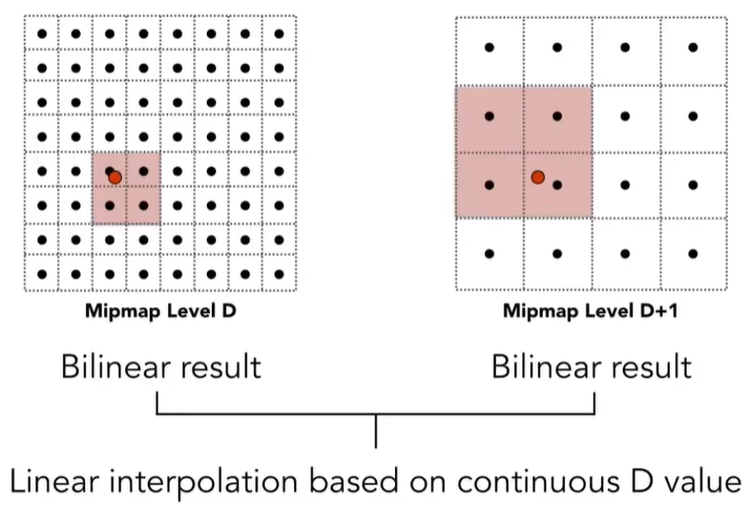

效果：

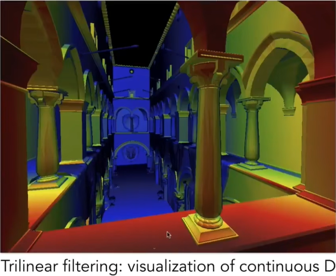

根据上述方法进行的三线性还是不能解决一开始提出的网格地板的走样问题，因为那个例子的插值效果如下：

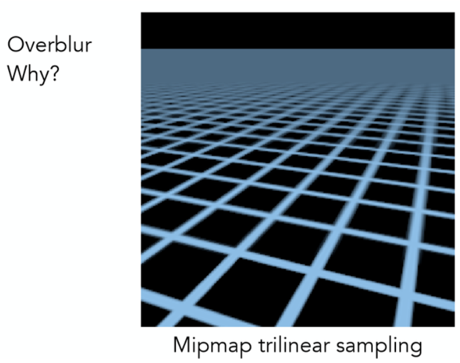

远处的地板全部糊在了一起，原因是在远处一个像素的footprint对应的是细长的平行四边形，而我们把它们近似成了正方形，mipmap只能查询正方形，近似得太过分了，从而导致了问题的出现。解决办法：各项异性过滤！

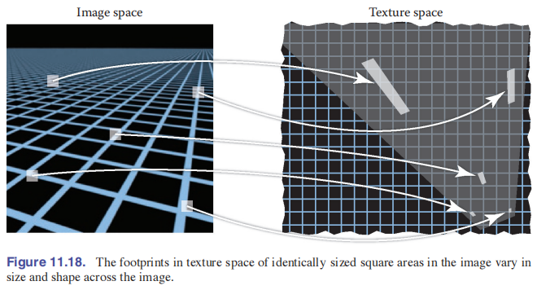

### 各项异性过滤

可以发现不同的footprint，有的需要较高的u方向level，有的需要较高的v方向level，因此启发了各项异性过滤。各项异性过滤如下图所示，每一行只有宽度发生变化；每一列只有高度发生变化，比miapmap上多了一些不均匀的水平和竖直方向的压缩。各项异性过滤的**存储是原本的三倍**

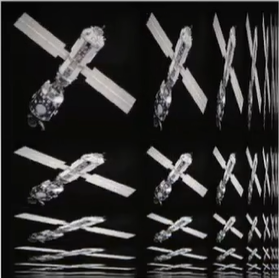

先计算水平方向的level，再计算竖直方向的level，查询。这里同样的也可以使用三线性插值。

各项异性过滤对于水平的或者竖直的方向查询是ok的，对于斜着的区域仍然不ok！这时需要EWA过滤

### EWA filter（椭圆加权平均）

EWA filter目前被认为是纹理过滤算法中最好的算法之一，它会追踪当前像素的纹理坐标对于屏幕空间坐标的微分，$\frac{du}{dx}$、$\frac{dv}{dx}$指的是屏幕空间的坐标水平变化一个单位时，纹理空间$du,dv$的变化程度。微分值越大，相同的间隔纹理坐标变化越大。$\frac{du}{dy}、\frac{dv}{dy}$同理。

具体的EWA算法是，首先，将两条向量($\frac{du}{dx},\frac{dv}{dx}$) 和 ($\frac{du}{dy},\frac{dv}{dy}$)中模长较小的向量的模长作为选择mipmap等级的依据。确定了mipmap等级之后，以($\frac{du}{dx},\frac{dv}{dx}$)和 ($\frac{du}{dy},\frac{dv}{dy}$)为两条轴构建一个椭圆，注意：两条轴不一定是垂直的，它们不一定能成为椭圆的长轴和短轴。推导椭圆系数的方法如下：

//先挖个坑，以后再填

计算出椭圆系数之后，用一个轴对齐包围盒包围住椭圆，遍历包围盒内的元素，并作加权平均(高斯filter 或 其它的filter都可以)

