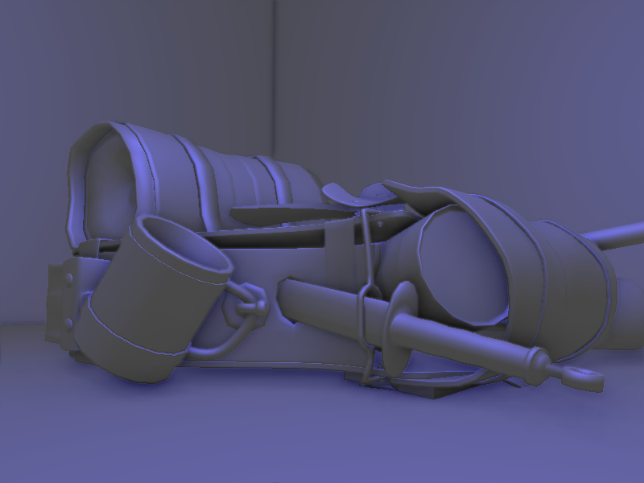
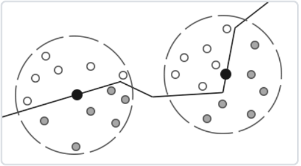
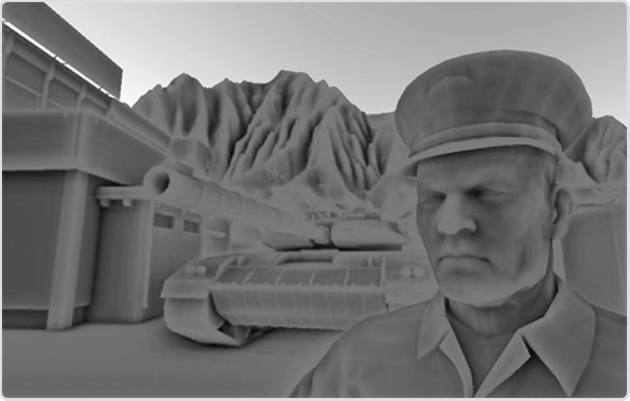
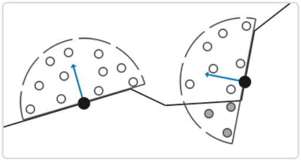

# SSAO算法

环境光照是我们加入场景总体光照中的一个固定光照常量，它被用来模拟光的**散射(Scattering)**。在现实中，光线会以任意方向散射，它的强度是会一直改变的，所以间接被照到的那部分场景也应该有变化的强度，而不是一成不变的环境光。其中一种间接光照的模拟叫做**环境光遮蔽(Ambient Occlusion)**，它的原理是通过将褶皱、孔洞和非常靠近的墙面变暗的方法近似模拟出间接光照。



启用SSAO的图像会给我们更真实的感觉，这些小的遮蔽细节给整个场景带来了更强的深度感。

环境光遮蔽这一技术会带来很大的性能开销，因为它还需要考虑周围的几何体。我们可以对空间中每一点发射大量光线来确定其遮蔽量，但是这在实时运算中会很快变成大问题。于是后来又有了**屏幕空间环境光遮蔽(Screen-Space Ambient Occlusion, SSAO)**

屏幕空间环境光遮蔽的大致思想是：对于铺屏四边形(Screen-filled Quad)上的每一个片段，我们都会根据周边深度值计算一个**遮蔽因子(Occlusion Factor)**。这个遮蔽因子之后会被用来减少或者抵消片段的环境光照分量。遮蔽因子是通过采集片段周围球型核心(Kernel)的多个深度样本，并和当前片段深度值对比而得到的。高于片段深度值样本的个数就是我们想要的遮蔽因子。

LearnOpenGL里面实现SSAO有4个pass：

1. 几何 pass，用来收集场景的几何数据。包括逐片段position值(view space)，显然这个值的z分量就是片段的线性深度；逐片段法线(view space)；以及一个颜色值albedo，现阶段这个值无关紧要。
2. SSAO pass，真正实现ssao效果的地方。
3. blur pass，模糊掉随机旋转采样核心带来的噪声。
4. lighting pass，做光照计算。

几何pass不详细展开，主要是FBO的设置与绑定。详细请参考LearnOpenGL->高级OpenGL->帧缓冲那个章节。

在进入ssao pass之前，我们除了逐片段的position和normal，还需要生成**64个随机样本点**和**旋转采样核心**。随机样本点定义在以shading point为原点，法线为z轴的局部坐标系内，因为我们不可能给每个shading point都设置随64个随机样本点。样本点乘上TBN矩阵之后就被转换到了view空间，但这只是个偏移量，我们还需将shading point加上这个偏移量之后才能得到view空间采样点的坐标。

生成样本点的代码如下：

```c++
	// generate sample kernel
    // ----------------------
    std::uniform_real_distribution<GLfloat> randomFloats(0.0, 1.0); // generates random floats between 0.0 and 1.0
    std::default_random_engine generator;
    std::vector<glm::vec3> ssaoKernel;
    for (unsigned int i = 0; i < 64; ++i)
    {
        //x,y分量的范围从（0，1）转换到（-1，1）;z分量的范围依旧是（0，1）
        glm::vec3 sample(randomFloats(generator) * 2.0 - 1.0, randomFloats(generator) * 2.0 - 1.0, randomFloats(generator));
        //归一化
        sample = glm::normalize(sample);
        //向量长度为（0，1）之间的随机数
        sample *= randomFloats(generator);
        float scale = float(i) / 64.0f;

        // scale samples s.t. they're more aligned to center of kernel
        scale = ourLerp(0.1f, 1.0f, scale * scale);
        sample *= scale;
        ssaoKernel.push_back(sample);
    }
```
noise是一张4*4大小的贴图，贴图的每一位存放了一个z分量为0的随机向量。取一个随机向量出来与法线做正交化之后就得到了tangent向量，这就是生成“旋转”采样核心的原理。

生成noise texture的代码如下：


```c++
	// generate noise texture
    // ----------------------
    std::vector<glm::vec3> ssaoNoise;
    for (unsigned int i = 0; i < 16; i++)
    {
        glm::vec3 noise(randomFloats(generator) * 2.0 - 1.0, randomFloats(generator) * 2.0 - 1.0, 0.0f); // rotate around z-axis (in tangent space)
        ssaoNoise.push_back(noise);
    }
    unsigned int noiseTexture; glGenTextures(1, &noiseTexture);
    glBindTexture(GL_TEXTURE_2D, noiseTexture);
    glTexImage2D(GL_TEXTURE_2D, 0, GL_RGBA32F, 4, 4, 0, GL_RGB, GL_FLOAT, &ssaoNoise[0]);
    glTexParameteri(GL_TEXTURE_2D, GL_TEXTURE_MIN_FILTER, GL_NEAREST);
    glTexParameteri(GL_TEXTURE_2D, GL_TEXTURE_MAG_FILTER, GL_NEAREST);
    glTexParameteri(GL_TEXTURE_2D, GL_TEXTURE_WRAP_S, GL_REPEAT);
    glTexParameteri(GL_TEXTURE_2D, GL_TEXTURE_WRAP_T, GL_REPEAT);
```


数据都已经准备好，我们在采样之前先说一下为什么要使用**半球采样核心**而不是球型采样核心。



对于一片平整的墙，很显然核心中有一半的样本点都在墙这个几何体上，所以导致平整的墙面也会显得灰蒙蒙的，出于这个原因我们使用一个沿着表面法向量的半球体采样核心。也就是说我们之关心表面上方的样本，不关心表面下方的样本，因为它不会影响到环境光遮蔽。





因此我们要在gbuffer里保留normal。

铺垫了那么多，ssao的步骤如下：

1. 读取position，normal，noise，建立局部坐标系。得到局部坐标系转view坐标系的矩阵TBN
2. for循环遍历64个样本点，对每个样本点
    - 转到view空间，再加上position，获得采样点在view空间的坐标
    - 把采样点转到屏幕坐标系
    - 用xy在深度贴图上采样，再与z进行比较
    - 根据比较结果修改遮蔽因子
3. 计算遮蔽系数
4. 输出到ssao贴图中

```c++
void main()
{
    // 读取片段的position 和 normal,在noise中读取一个z分量为0的随机向量randomVec
    vec3 fragPos = texture(gPosition, TexCoords).xyz;
    vec3 normal = normalize(texture(gNormal, TexCoords).rgb);
    vec3 randomVec = normalize(texture(texNoise, TexCoords * noiseScale).xyz);
    // create TBN change-of-basis matrix: from tangent-space to view-space
    //用施密特正交化使得randomVec垂直于normal
    vec3 tangent = normalize(randomVec - normal * dot(randomVec, normal));
    //tangent与normal叉乘得到b，建立好了一个以片段position为原点的局部坐标系
    vec3 bitangent = cross(normal, tangent);
    mat3 TBN = mat3(tangent, bitangent, normal);
    // iterate over the sample kernel and calculate occlusion factor
    float occlusion = 0.0;
    for(int i = 0; i < kernelSize; ++i)
    {
        // 获得sample的位置，并转换到view空间
        vec3 samplePos = TBN * samples[i]; // from tangent to view-space
        //对fragpos做偏移，得到了view空间采样点的坐标
        samplePos = fragPos + samplePos * radius; 
        
        // project sample position (to sample texture) (to get position on screen/texture)
        vec4 offset = vec4(samplePos, 1.0);
        //做投影 透视除法 转到(0,1)，得到了采样点的屏幕坐标
        offset = projection * offset; // from view to clip-space
        offset.xyz /= offset.w; // perspective divide
        offset.xyz = offset.xyz * 0.5 + 0.5; // transform to range 0.0 - 1.0
        
        // 屏幕坐标的xy分量在gPosition上采样，得到这个片段的深度
        float sampleDepth = texture(gPosition, offset.xy).z; // get depth value of kernel sample
        
        // gPosition的深度与采样点的深度做比较
        float rangeCheck = smoothstep(0.0, 1.0, radius / abs(fragPos.z - sampleDepth));
        occlusion += (sampleDepth >= samplePos.z + bias ? 1.0 : 0.0) * rangeCheck;           
    }
    occlusion = 1.0 - (occlusion / kernelSize);
    
    FragColor = occlusion;
}
```

做个blur

光照计算的时候把逐片段ao乘到ambient分量