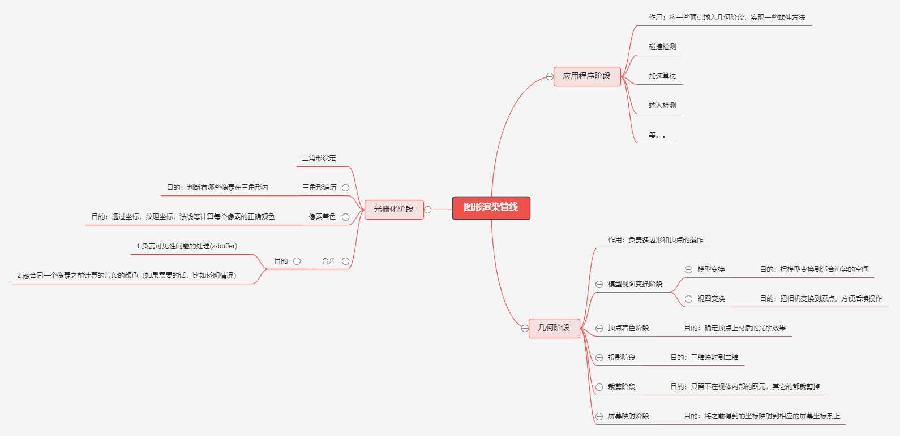
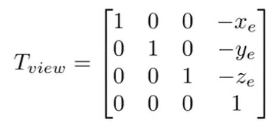
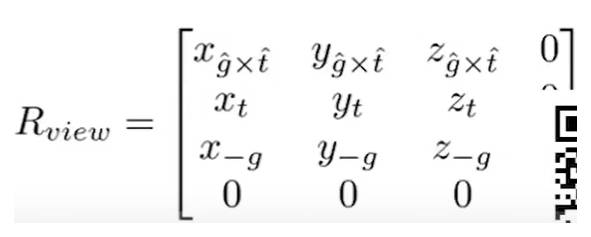
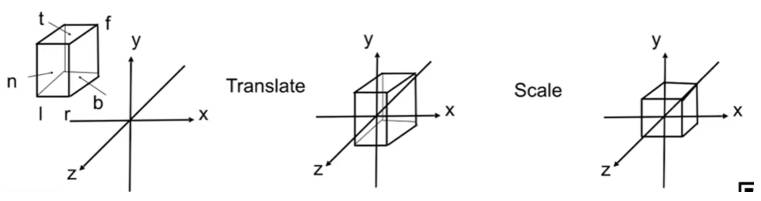
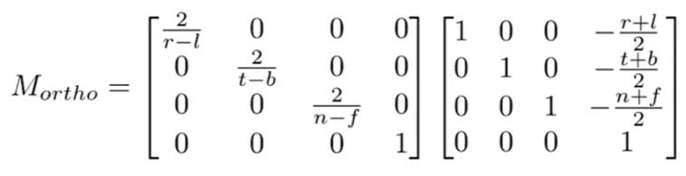
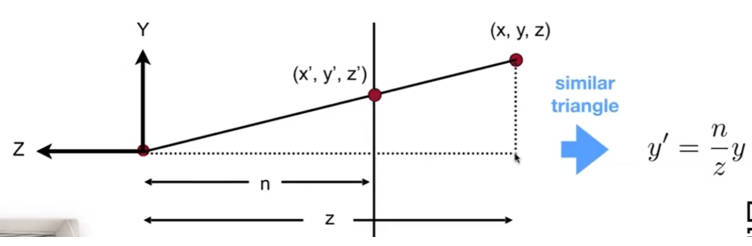
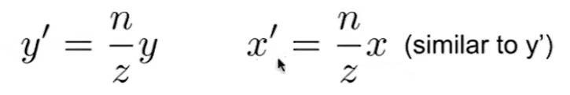
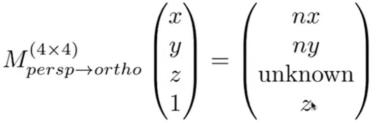
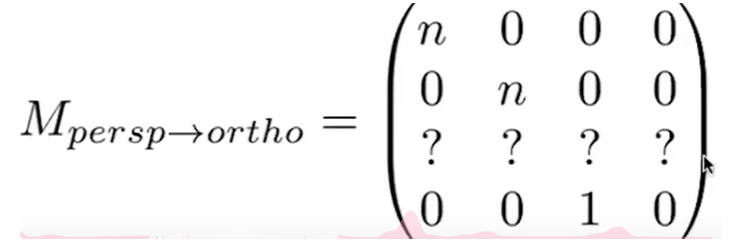
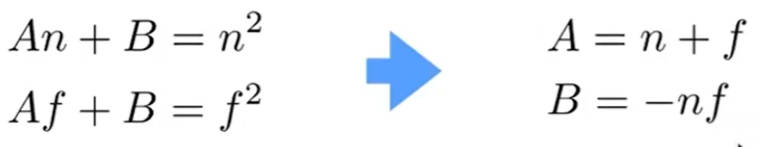

# 图形渲染管线

## 应用程序阶段

任务：在应用程序阶段的末端，将需要在屏幕上（具体形式取决于具体输入设备）显示出来绘制的几何体（也就是绘制图元，rendering primitives，如点、线、矩形等）输入到几何阶段。

what：是通过软件方式来实现的阶段，开发者能够对该阶段发生的情况进行完全控制，可以通过改变实现方法来改变实际性能。

how：该阶段可以实现碰撞检测（待展开），

[加速算法](./加速算法.md)

以及层次视锥裁剪（待展开）等。

---

## 几何阶段

任务：

1. 将顶点变换到适合计算的空间，方便光栅化阶段进行操作。比如最开始顶点在模型空间中，最终我们要把待渲染的顶点变换到屏幕坐标空间中才能在屏幕上把顶点画出来；
2. 为每个顶点准备光栅化阶段要用的数据。

what：几何阶段包含一系列的变换，world→view→vertexShading→projection→clip→viewport。

how：

[变换矩阵](./变换矩阵.md)

### world变换

任务：变换模型的顶点和法线到场景中想要的位置

what：顶点直接左乘model矩阵，法线左乘model的逆的转置。

### view变换

why：因为我们只需要在屏幕上显示相机所看到的部分

what：整个场景随着相机旋转平移(因此相对位置不变)，把相机平移到原点，向上方向为y轴并且看向-z轴

how：

1.建立直角坐标系。规定一个相机位置e，一个向上方向t和一个lookAt向量g，g和t叉乘得到right向量。旋转平移之后t对应y轴，right对应x轴，g对应-z轴。

2.先做平移再做旋转，平移矩阵：

旋转矩阵：

### vertexShading

why：一般是在view坐标系中做顶点的着色，其实这一步也不是做单纯的着色，而是把需要参与光照计算的信息在此处进行计算，已方便后续的光栅化处理

what：着色应用在每个顶点上，在光栅化阶段把顶点上的颜色插值到片段上。

how：高洛德着色模型

### projection投影

why：目前为止顶点信息还是三维的，但是我们最终要渲染在二维屏幕上，因此要进行投影操作。

what：分为**正交投影**和**透视投影**两种。

how：

#### 正交投影

 效果：平行的线投影之后还是平行的，物体的大小不会随着位置而改变

简单来理解就是把顶点的z分量直接丢掉。正规的过程是，把视体(包围待渲染出来的图元的立方体)中心平移到原点，再把  $x,y,z$  轴均缩放到$[-1,1]^3$，这是预定俗成的，$[-1,1]^3$被称为canonical cube，也称为CVV空间

数学形式：先平移再缩放

#### 透视投影

效果：近大远小，平行的线投影之后不再平行

what：

how：从一个点往外延申出来一个四棱锥，这个点是相机。定义一个近平面和远平面，近平面和远平面与四棱锥相交的部分就是视锥体frustum。整个透视投影分为两个部分：

1.把frustum的远平面以及中间的部分“挤”成近平面一样的大小，得到一个长方体。

规定：

1. 近平面上任一个点(x,y,n,1)不变。
2. 远平面的任一个点z值不变。
3. 远平面的中心点(0,0,f,1)不变

接下来考虑如何“挤”，做变换！

**性质：对于中间的任何一点(x,y,z,1)，投影之后z会被推向远平面**

2.再对该长方体做正交投影

### clip裁剪

目的：图元完全或部分存在于视体（也就是上文的规范立方体，CVV）内部的时候，才需要将其发送到光栅化阶段

what： 保留在单位立方体内的图元，剔除单位立方体之外的图元

how：一个图元相对视体内部的位置，分为三种情况：完全位于内部、完全位于外部、部分位于内部。所以就要分情况进行处理：

- 当图元完全位于视体内部，那么它可以直接进行下一个阶段。
- 当图元完全位于视体外部，不会进入下一个阶段，可直接丢弃，因为它们无需进行渲染。
- 当图元部分位于视体内部，则需要对那些部分位于视体内的图元进行裁剪处理

### viewport视口变换

why：图元最终要显示在屏幕上，左下角是坐标(x1,y1) ，x1,y1>0，但是目前图元还在CVV空间$[-1,1]^3$中，因此要变换到屏幕坐标系内

what：将图元移动到视口内

how：

**问题：整型和浮点型的点值如何与像素坐标(纹理坐标)相关联？**

整型->浮点型：+0.5；浮点型->整型：floor

---

## 光栅化阶段

why：屏幕上的每个像素都是有颜色信息的，然而几何阶段只对顶点进行了处理。换句话说，几何阶段的信息粒度是三角形的顶点，而最终呈现在屏幕上的信息粒度是像素，因此就要进行三角形的光栅化。

what：遍历整个三角形内部所有的像素，计算每个像素的颜色

how：

#### 三角形设定阶段（纯硬件执行）

#### 三角形遍历阶段：

what：在三角形遍历阶段将进行逐像素检查操作，检查该像素处的像素中心是否由三角形覆盖

#### 像素着色：

任务：利用从顶点着色器里传来的信息计算当前片段的颜色。

what：是高级光照产生的地方

how：phong shading，blinn-phong shading

#### 融合：

任务：

1. 合成当前储存于缓冲器中的由之前的像素着色阶段产生的片段颜色；
2. 还负责可见性问题（Z 缓冲相关）的处理

what：是管线的最后一个阶段，当前像素对应的多个片段的颜色的融合结果。

how：有一系列的缓冲器用来过滤和捕获片段信息

- alpha通道
- 模板缓冲器：类似一个mask的操作
- 帧缓冲器：颜色+Z缓冲的组合
- 累计缓冲器：用来产生运动模糊，景深，反走样，软阴影