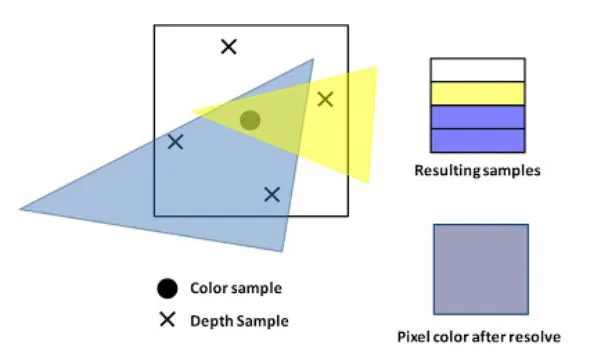

# 抗锯齿算法

锯齿产生的原因：像素本身有一定的大小，将视口内的三角形光栅化的时候，我们要用像素的中心对三角形进行一个可见性采样，采样率对于信号来说是不够高的，所以会产生信号走样的问题。

反走样思想：先模糊后采样（不可以先采样后模糊，因为采样之后是有锯齿的，再模糊也还是有锯齿）

## SSAA

why：既然锯齿的出现是因为采样率过低，那么就提高采样率

what：在一个母采样点中采样多次，每个子采样点都会重复一遍母采样点的流程，判定是否在三角形内、深度检测、着色，最后每个子采样点都会得到各自的颜色，母像素的颜色就是子采样点颜色的平均

SSAA的开销：

1. 原始的算法会为像素点维护depth_buffer和color_buffer，n个像素点就分别对应n大小的数组，使用SSAA后，子采样点的深度和颜色也需要维护，所以depth_buffer和color_buffer的数组大小就扩充为$k*n$。
2. SSAA的计算复杂度也会增大，判定是否在三角形内、深度检测、计算着色的操作也会增多

## MSAA(Multisample Antialiasing)

why：为了抗锯齿，想把三角形覆盖了一个像素的多少计算出来。这并不容易，且计算量很大。MSAA提供了一个近似方法。

what：是一个反走样的近似，严格意义上并不能完全解决反走样问题

how：对任一像素，划分成了很多个子像素，每个子像素有一个中心(采样点)，计算三角形覆盖了多少子像素。

以上图为例，MSAA具体的执行步骤如下：

1. 光栅化阶段，对四个X位置的Sample执行三角形覆盖判断，在一个四倍分辨率大小的coverage mask中记录每个Sample被覆盖的情况。
2. 像素着色阶段，在像素中心圆点处执行像素着色器。该点的位置、深度、法线、纹理坐标等信息由三角形三个顶点重心插值得到。图中计算得到像素颜色为紫色。
3. 对四个Sample执行模板测试与深度测试，并将测试通过的Sample数据写入四倍分辨率的模板缓冲与深度缓冲。每个Sample都拥有自己的深度值，依然是重心插值得到。
4. 上图中左下两个Sample通过了深度测试，并且coverage mask为1，因此将紫色复制到这两个Sample对应的颜色缓冲中（依然是每个Sample一个颜色，共四倍大小）。其他两个Sample暂为背景色。
5. 重复上述流程绘制第二个黄色三角形，将像素着色获得的黄色复制到右上角的Sample中。
6. 所有绘制结束之后，通过一个对高层透明的PASS，将四个Sample的颜色插值获得最终输出的像素颜色

可以看到在MSAA流程中所使用的所有缓冲区都变成了原来的四倍大小，这也是为什么MSAA增加了非常多的显存和带宽消耗。上述流程中第4步如果改成对每个Sample运行像素着色，MSAA就变成了SSAA。

## FXAA（Fast Approximate AA）

what：和增加采样点无关，是图像的后期处理

how：得到有锯齿的图后，用图像匹配的方式(边缘检测算法：canny，sobel，Laplacian)找到图形边界，把边界用没有锯齿的边替换掉

## TAA（Temporal AA）

what：与时间相关

how：对当前帧的图像信息，复用上一帧，上上帧。。。把MSAA用的采样点，分布在时间上，再做一个平均。

## Wu抗锯齿算法

Wu是一种专门对**直线**进行抗锯齿的算法

https://blog.csdn.net/m0_56494923/article/details/128516263