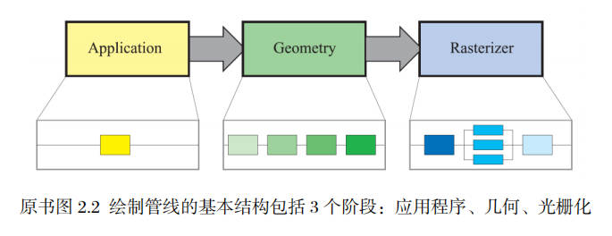

# 渲染管线

 [图形渲染管线](./图形渲染管线.md/#pipeline)

图形渲染管线是逻辑管线，描述了一般管线的大致思想和流程；而GPU渲染管线是物理管线，是GPU中真实存在的。

------

[GPU渲染管线](./GPU渲染管线.md/#GPUpipeline)

在GPU中没有application阶段，因此此处只有几何和光栅化阶段

GPU渲染管线只比图形渲染管线多了曲面细分着色器和几何着色器

