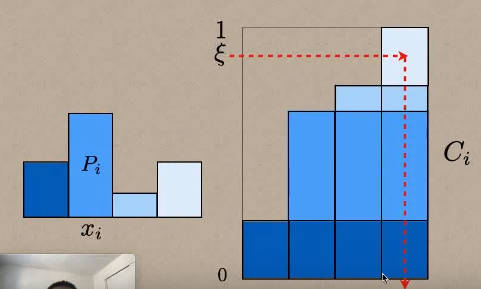
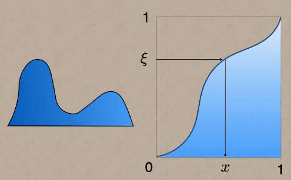
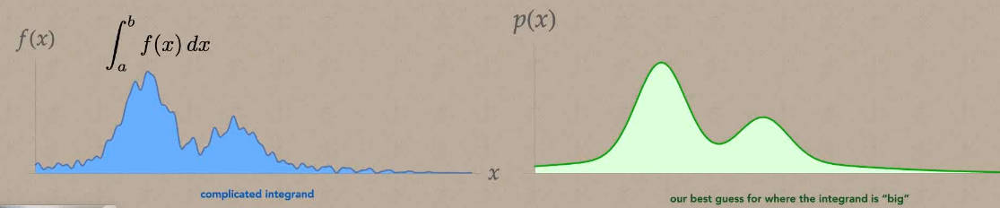
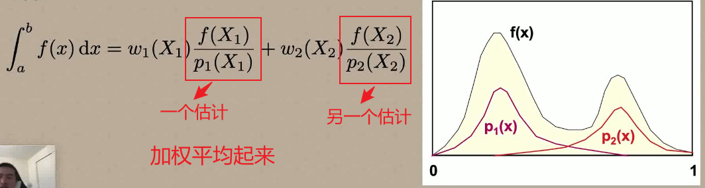
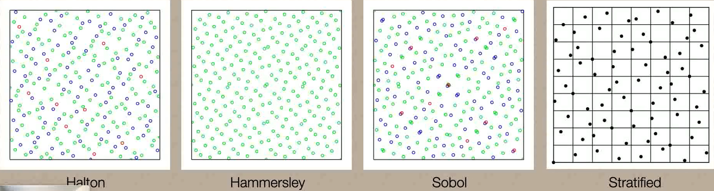
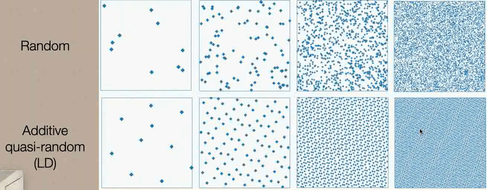

# 重要性采样

why：对于复杂函数的积分要用蒙特卡洛的方法来计算，蒙特卡洛涉及到采样的问题。正常情况下采样密度越高蒙特卡洛积分的结果越准确，但是高密度采样会带来大量的计算消耗。于是思考有什么方法能够在一定的采样数量基础上来增加准确度，减少方差？这需要人为的对采样的分布进行干预，因此引申出重要性采样。另外，重要性采样的另一个应用是路径追踪，对光线下一次弹射的方向进行采样。

what：重要性采样是蒙特卡洛积分的一种采样策略。

how：

## 蒙特卡洛算法

求函数$f(x)$在区间$[a,b]$上的积分，$\int_{a}^{b}f(x)dx$，在区间$[a,b]$上对采样点以某种分布$pdf(x)$采样，则积分可以表示为：

$$\int_{a}^{b}f(x)dx=\frac{1}{N}\sum_{i=1}^{N}\frac{f(x_i)}{pdf(x_i)}$$

$pdf(x)$满足：$\int_{-\infty}^{+\infty}pdf(x)dx=1$

举一个例子：假设现在是均匀采样，样本点为：$\left\{x_1,x_2,……,x_n\right\}$,值为$\left\{f(x_1),f(x_2),……,f(x_n)\right\}$, $pdf(x)=\frac{1}{b-a}$，则可以得到这样的估计：

$$\int_{a}^{b}f(x)dx=\frac{b-a}{N}\sum_{i=1}^{N}f(x_i)$$

**蒙特卡洛是无偏估计**

### 给一个$pdf(x)$,如何按照这个分布生成样本？

##### 离散分布

把概率分布累加，得到$[0,1]$上的多个区间，在$[0,1]$上均匀取一个$\xi$，落在哪个区间就取哪个值。

##### 连续分布

和离散分布类似，用累计概率分布

## 重要性采样

$pdf$可以随机选取，但是我们要找一个“最合适的”，有两种方法可以度量。1.对于相同的样本数量，$pdf1$已经收敛了，但是$pdf2$还在震荡，所以$pdf1$更合适。2.到收敛，用的样本越少越合适。

结论：**$pdf(x)$的图像和被积函数$f(x)$的图像越接近，$pdf(x)$采样的效果越好**，也就是说，在$f(x)$较大的区间，$pdf(x)$也大，落在该区间的样本点越多，采样效果越好。$f(x)$小的区间，不应该有很多采样点，因为采了也没用，$pdf(x)$小比较合适。**$pdf(x)$最好正比于被积函数**

问题：我们往往不知道被积函数的形状，如何确定pdf的形状？

可以先⽤少量的样本进⾏⼀个采样，然后拟合⼀个简单的曲线，再根据该曲线进⾏采样，这种⽅法也叫做 adaptive sampling ⽅法

## 多重重要性采样

对于复杂被积函数，往往需要不同的采样分布，如何把多种采样方法结合起来？答案是可以

对下面这个被积函数$f(x)$，$p_1(x)$覆盖了其中一个峰值，$p_2(x)$覆盖了另一个峰值。当我们用$p_1(x)$来采样的时候照顾不到第二个峰值，反之用$p_2(x)$同理。那我们想办法把两个pdf结合起来，使得拥有两者共同的优点。

先用$p_1(x)$采样一个样本$X_1$，再用$p_2(x)$采样另一个样本$X_2$，加权平均。

但是如何确定权重？肯定不是0.5，0.5那么简单。当我们采到一个样本X，计算哪个$p_k(X)$占总体比重大，谁大就用谁。因此可以得到权重为：

$$\omega_i(X)=\frac{p_i(X)}{\sum_{k}p_k(X)}$$

## 样本选择(LD: low discrepancy)

低差异化序列的优点：

1. 可以无限取样本
2. 相比于纯随机非常的均匀；
3. 相比于纯随机，收敛速度非常快

缺点：LD序列在高维的情况下会变得不LD

## 重要性采样在路径追踪中的应用

## 重要性采样在求解渲染方程上的应用

渲染方程：

$$L_o(p,\omega_o)=L_e(p,\omega_o)+\int_{\Omega^+}L_i(p,\omega_i)f_r(p,\omega_i,\omega_o)(n·\omega_i)d\omega_i$$

不看自发光项，被积函数包括3个部分，光源$L_i$（是递归定义，包括直接光照和间接光照），BRDF项和cos项。对整个被积函数设计$pdf$是不现实的，我们可以对这三项分别设计$pdf$

### cos-weighted重要性采样
