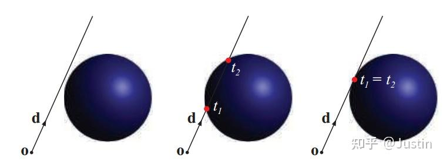

# 如何判断射线与球体相交
球体表面的表达式：$(x-c)*(x-c)=r^2$，射线表达式：$x(t)=o+dt$。把射线表达式代入球面表达式：$((o+dt)-c)*((o+dt)-c)=r^2$，化简之后得到关于t的一元二次方程，若方程有解，说明有交点。

左：$b^2-4ac<0$                   中：$b^2-4ac>0$                      右：$b^2-4ac=0$

通过判断符号即可判断是否与球体相交

优化后的方法：

<!--  -->

计算向量$l=c-o$，计算$l$在$d$上的投影$S=l*d$。

若$S<0$(中间)没有交点

若$l*l = r*r$（右），射线出发点在圆内，一定有交点。

对左边的情况，用勾股定理计算出$m$，$m<r$ 说明有交点。

若还要计算交点是多少，方法如下：

$q^2=r^2-m^2$，所以交点为$s-q$和$s+q$。