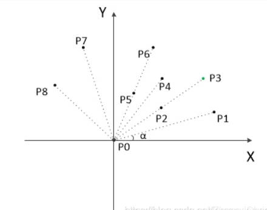

# 给定点集求凸包

## 1.暴力法

思路：两点确定一条直线，如果剩余的其它点都在这条直线的同一侧，则这两个点是凸包上的点，否则就不是。$O(n^3)$

$n$个顶点有$\frac{n(n-1)}{2}$条边，对每条直线，检查剩余n-2个点是否在直线的同一侧。

答：用叉乘。$p_1$，$p_2$连成的直线，用$p_1p_3$叉乘$p_1p_2$，若符号均相同，说明全在同一侧

## 2.分治法

O（nlogn）

1. 把所有的点都放在二维坐标系里面。那么横坐标最小和最大的两个点p1,pn一定是凸包上的点。直线p1pn把点集分成了两部分，即X轴上面和下面两部分，分别叫做上包和下包。
2. 对上包：求距离直线$p_1p_n$最远的点，假设为点 $p_{max}$。
3. 作直线  $p_1p_{max}$ 、$p_np_{max}$，把直线 $p_1p_{max}$ 左侧的点当成是上包，把直线  $p_np_{max}$  右侧的点也当成是上包。
4. 重复步骤 2、3。
5. 对下包也作类似操作。

如何求距离直线  $p_1p_n$  最远的点？遍历直线上方的点，计算点到直线的距离即可。

## 3.Javis步进法

O(nH)，H为凸包上的点的个数

思路：纵坐标最小的那个点一定是凸包上的点，例如p0。从p0开始，按逆时针的方向，逐个找凸包上的点，每前进一步找到一个点，所以叫作步进法。

假设现在已经找到了p0,p1,p2为凸包上的点，要找下一个点，剩下的点分别和p2组成向量，设这个向量与向量p1p2的夹角为 β。β最小就是所求的下一个点。

在找p1的时候，由于只有p0，只能与p0所在的水平线做夹角。

## 4.Graham(格拉翰)扫描法

纵坐标最小的那个点一定是凸包上的点，记为p0，平移所有坐标点，使p0在原点。

计算各个点相对于p0的幅角 α，按α排序，α相同按与p0的距离排序。

排好序后，第一个点p1与最后一个点p8一定在凸包上。

1. 以上，我们已经知道了凸包上的第一个点p0和第二个点p1，我们把它们放在栈里面。现在从步骤3求得的那个结果里，把p1后面的那个点拿出来做当前点，即p2。接下来开始找第三个点。
2. 连接栈最上面的两个元素，得到直线L。看当前点是在直线L的右边还是左边。如果在直线的右边就执行步骤3；如果在直线上，或者在直线的左边就执行步骤4。
3. 如果在右边，则栈顶的那个元素不是凸包上的点，把栈顶元素出栈。执行步骤2。
4. 当前点是凸包上的点，把它压入栈，执行步骤5。
5. 检查当前的点是不是步骤排序后最后一个元素。是最后一个元素的话就结束。如果不是的话就把当前点后面那个点做当前点，返回步骤2。
6. 最后，栈中的元素就是凸包上的点了。