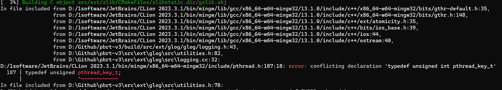

# Install

## 用vs2019编译

## 用MinGW Makefiles编译

### 下载

```c++
$ git clone --recursive https://github.com/mmp/pbrt-v3/
```

### build

进入pbrt-v3文件夹，在命令行

```c++
cmake -B build

```

ming32有两种版本，posix和win32，我使用的是clion，clion默认安装的是posix版本的ming32，这和pthread冲突，会报如下错误



给系统安装win32版本的ming32就能解决。

