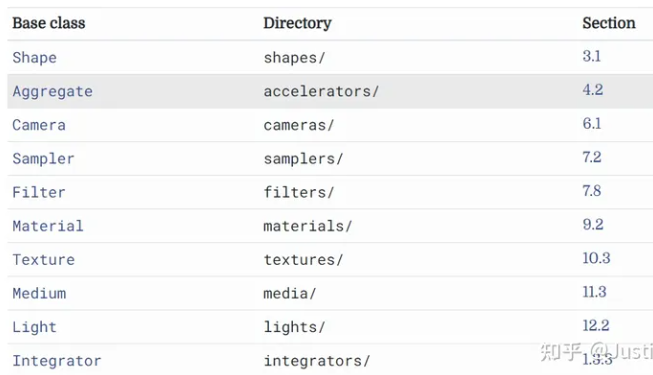
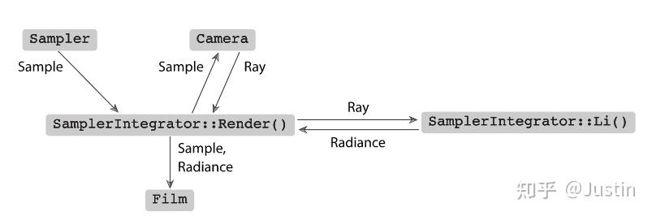

# 系统概述

pbrt是使用标准的面向对象技术构造的:抽象基类是为重要的实体定义的(例如，一个Shape抽象基类定义了所有几何形状必须实现的接口，Light抽象基类对灯光的行为类似，等等)。系统的大部分实现纯粹是基于这些抽象基类提供的接口;例如，检查光源和阴影点之间遮挡物体的代码调用Shape intersection方法，并且不需要考虑场景中出现的特定形状类型。这种方法使得扩展系统变得很容易，因为添加一个新形状只需要实现一个实现shape接口的类，并将其链接到系统中。

pbrt总共使用10个关键抽象基类编写，如表1.1所示。向系统中添加这些类型中的一种的新实现是很简单的;实现必须从适当的基类继承，被编译并链接到可执行文件中，并且必须修改附录B中的对象创建例程，以便在解析场景描述文件时根据需要创建对象的实例。第A.4节更详细地讨论了以这种方式扩展系统。

表1.1:主要接口类型。大多数pbrt是根据10个关键抽象基类实现的，列在这里。可以很容易地将这些实现添加到系统中，以扩展其功能。



pbrt源代码可从[http://pbrt.org](https://link.zhihu.com/?target=http%3A//pbrt.org)获得。(大量的示例场景也可以单独下载。)pbrt核心的所有代码都在src/core目录中，main()函数包含在简短文件main/pbrt.cpp中。抽象基类实例的各种实现都在不同的目录中:src/shapes实现了Shape基类，src/materials实现了Material，等等。

### 执行阶段

PBRT在概念上可以分为两个执行阶段。首先，它解析用户提供的场景描述文件。场景描述是一个文本文件，它指定了构成场景的几何形状、它们的材质属性、照亮它们的灯光、虚拟摄像机在场景中的位置，以及整个系统中使用的所有单独算法的参数。输入文件中的每个语句都直接映射到附录a中的一个例程;这些例程组成了描述场景的程序接口。场景文件格式记录在pbrt网站[pbrt-v3 Input File Format](https://pbrt.org/fileformat-v3)上。

解析阶段的最终结果是Scene类的一个实例和Integrator类的一个实例。场景包含场景内容的表示(几何对象、灯光等)，积分器实现了一个算法来渲染它。积分器之所以被称为积分器，是因为它的主要任务是计算公式(1.1)的积分。

一旦场景被指定，第二阶段的执行就开始了，主渲染循环就会执行。这个阶段是pbrt通常花费大部分运行时间的地方，本书的大部分内容描述了在这个阶段执行的代码。呈现循环是通过执行Integrator::Render()方法的实现来执行的，这是第1.3.4节的重点。

本章将描述一个叫做SamplerIntegrator的特殊的积分器子类，**用来渲染次表面散射现象的pathIntegrator就是SamplerIntegrator的子类**，SamplerIntegrator的Render()方法决定了到达一个虚拟相机平面的大量光线，这些光线模拟了图像形成的过程。在计算所有这些胶片样本的贡献后，最终的图像被写入一个文件。内存中的场景描述数据被释放，然后系统继续处理场景描述文件中的语句，直到没有剩余的语句为止，允许用户指定另一个要呈现的场景(如果需要)。

### 场景表示

Pbrt的main()函数可以在main/ Pbrt .cpp文件中找到。这个函数非常简单;它首先循环argv中提供的命令行参数，初始化Options结构中的值，并存储参数中提供的文件名。使用-help作为命令行参数运行pbrt将打印可以在命令行上指定的所有选项。解析命令行参数<<Process命令行参数>>的片段很简单，因此不在本书中。

然后将选项结构传递给pbrtInit()函数，该函数执行系统范围的初始化。然后main()函数解析给定的场景描述，从而创建一个场景和一个积分器。在所有呈现完成之后，pbrtCleanup()在系统退出之前进行最后的清理。

pbrtInit()和pbrtCleanup()函数出现在页边距的迷你索引中，以及它们实际定义的页数。迷你索引具有指向几乎所有在每个页面上使用或引用的函数、类、方法和成员变量定义的指针。

```c++
<<Main program>>= 
int main(int argc, char *argv[]) {
    Options options;
    std::vector<std::string> filenames;
    <<Process command-line arguments>> 
    pbrtInit(options);
    <<Process scene description>> 
    pbrtCleanup();
    return 0;
}
```

如果运行pbrt时没有提供输入文件名，则从标准输入读取场景描述。否则，它将遍历所提供的文件名，依次处理每个文件。

```c+
<<Process scene description>>= 
if (filenames.size() == 0) {
    <<Parse scene from standard input>> 

} else {
    <<Parse scene from input files>> 
}
```

### 积分器接口和采样积分器

场景图像的呈现由实现Integrator接口的类的实例处理。Integrator是一个抽象基类，它定义了所有积分器必须提供的Render()方法。在本节中，我们将定义一个Integrator实现，SamplerIntegrator。积分器的基本接口定义在core/integrator.h中，集成器使用的一些实用函数在core/integrator.cpp中。各种积分器的实现在integrators目录中。

Integrator接口的类内部只有一个纯虚函数——Render()

```c++
<<Integrator Declarations>>= 
class Integrator {
public:
    // Integrator Interface
    virtual ~Integrator();
    virtual void Render(const Scene &scene) = 0;
};
```

Integrators必须提供的方法是Render();它被传递给场景来计算场景的图像，或者更一般地说，一组场景照明的测量值。这个接口有意地保持非常通用，以允许广泛的实现——例如，可以实现一个积分器，只在分布在场景中的稀疏位置集进行测量，而不是生成一个常规的2D图像。

在本章中，我们将重点关注SamplerIntegrator，它是Integrator的子类，以及实现SamplerIntegrator接口的whitteintegrator。(其他samplerintegrator的实现将在第14和15章介绍;第16章中的积分器直接继承自Integrator。)SamplerIntegrator的名称源于它的呈现过程是由来自Sampler的样本流驱动的这一事实;每个这样的样本识别图像上的一个点，积分器应该在这个点计算到达的光来形成图像。

```c++
// SamplerIntegrator Declarations
class SamplerIntegrator : public Integrator {
  public:
    // SamplerIntegrator Public Methods
    SamplerIntegrator(std::shared_ptr<const Camera> camera,
                      std::shared_ptr<Sampler> sampler,
                      const Bounds2i &pixelBounds)
        : camera(camera), sampler(sampler), pixelBounds(pixelBounds) {}
    
    //Preprocess函数在场景定义之后，渲染开始之前做一些额外的初始化工作，比如对light进行初始化。
    virtual void Preprocess(const Scene &scene, Sampler &sampler) {}
    
    void Render(const Scene &scene);
    
    //Li()方法确定沿射线到达图像平面上的光量。
    virtual Spectrum Li(const RayDifferential &ray, const Scene &scene,
                        Sampler &sampler, MemoryArena &arena,
                        int depth = 0) const = 0;
    Spectrum SpecularReflect(const RayDifferential &ray,
                             const SurfaceInteraction &isect,
                             const Scene &scene, Sampler &sampler,
                             MemoryArena &arena, int depth) const;
    Spectrum SpecularTransmit(const RayDifferential &ray,
                              const SurfaceInteraction &isect,
                              const Scene &scene, Sampler &sampler,
                              MemoryArena &arena, int depth) const;

  protected:
    // SamplerIntegrator Protected Data
    std::shared_ptr<const Camera> camera;

  private:
    // SamplerIntegrator Private Data
    std::shared_ptr<Sampler> sampler;
    const Bounds2i pixelBounds;
};
```

SamplerIntegrator存储一个指向Sampler的指针。采样器的作用是微妙的，但它的实现可以实质上影响系统生成的图像的质量。首先，采样器负责选择图像平面上的点，从这些点可以追踪光线。其次，它负责提供积分器用于估计积分(公式(1.1))值的样本位置。例如，一些积分器需要在光源上随机选择点来计算面光源的照度。生成这些样本的良好分布是渲染过程的一个重要部分，它可以极大地影响整体效率;这个主题是第七章的重点。

Camera对象控制观看和镜头参数，如位置、方向、聚焦和视场。Camera类中的Film成员变量处理图像存储。Camera类在第6章描述，Film在第7.9节描述。Film负责将最终图像写入文件，并可能在计算时将其显示在屏幕上。

SamplerIntegrator构造函数将指向这些对象的指针存储在成员变量中。SamplerIntegrator是在RenderOptions::MakeIntegrator()方法中创建的，该方法由pbrtWorldEnd()调用，当从输入文件解析场景描述并准备呈现场景时，输入文件解析器将调用该方法。

### 主渲染循环

在分配和初始化场景和积分器之后，将调用Integrator::Render()方法，启动pbrt执行的第二个阶段:主渲染循环。SamplerIntegrator的实施这种方法,在每一个图像平面上的一系列位置,该方法使用相机和取样器来在场景中生成一条射线 ,然后使用Li()方法来确定沿射线到达图像平面上的光量。这个值被传递给Film，它记录光的贡献。图1.17总结了此方法中使用的主要类以及其中的数据流。



图1.17:core/integrator.cpp中的SamplerIntegrator::Render()方法中主呈现循环的类关系。采样器提供了一个采样值序列，每个采样值对应一个要采集的图像样本。Camera将样本转换为来自Film平面的相应射线，Li()方法实现计算沿到达Film的射线的亮度。采样及其亮度被赋给Film，Film将它们的贡献存储在图像中。这个过程不断重复，直到采样器提供了生成最终图像所需的足够多的样本。