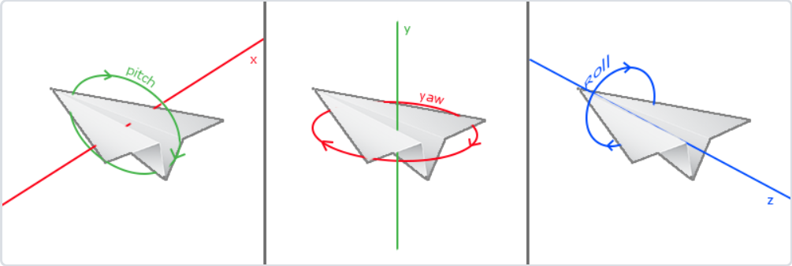
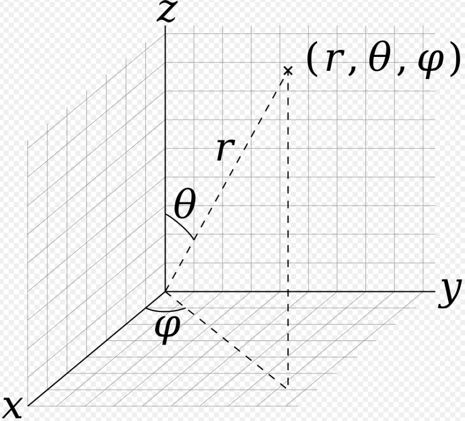

# Camera

改变camera的位置，使相机移动起来

```c++
auto view = glm::lookAt(glm::vec3(sin(glfwGetTime())*10.0f,0.f,cos(glfwGetTime())*10.0f),center,up);
shader.setMat4("view",view);
```

改变x，z的值，x，z满足$x^2+z^2=r^2$这里$r=10$，让相机绕着y轴旋转。但是问题来了，如果让相机绕着x轴旋转或者z轴旋转

```c++
auto view = glm::lookAt(glm::vec3(0.f,sin(glfwGetTime())*10.0f,cos(glfwGetTime())*10.0f),center,up);//绕x轴
shader.setMat4("view",view);
```

会出现间断的 图像不连续的现象，暂时不知道是什么原因

Camera本质上操作的是view空间。要实现**自由移动**和**视角移动**，自由移动指的是摄像机的前后、左右、上下移动；视角移动指的是相机位置不变，相机看向的方向改变。视角移动有三种方式：pitch、yaw和roll。



既然操作的是view空间，那么类中必须要存原点位置(cameraPos)和三根坐标轴。定义这个空间需要3个参数：cameraPos，center(相机看向的点)，up向量。

构建坐标系方法如下：

1. center-cameraPos得到front向量
2. up向量和front向量叉乘得到right向量
3. front 和 right叉乘得到up向量。需要此步计算是因为一开始的front和up可能并不垂直！

### 自由移动

自由移动可以用相机位置沿三根坐标轴的正/反向移动一个speed来实现。

```c++
//向左移动
cameraPos += cameraSpeed * (-right);
//向右移动
cameraPos += cameraSpeed * right;
//其余同理。。。。。
```

### 视角移动

视角移动需要改变front向量和up向量。从图中可看出pitch相当于front在绕着right向量转；yaw相当于front在绕着up向量转；roll相当于up在绕着front转(roll很少使用)，但是我们现在不考虑roll，因此只需要改变front向量

如果我们按照旋转的思路，要这么写

```c++
    //此计算方式不可，因为每移动一次，就要算出移动的角度，这要用到反三角函数
    void pitch(float angle){
        glm::mat4 pitch = glm::rotate(glm::mat4(1.f),glm::radians(angle),right);
        front = glm::normalize(pitch*glm::vec4(front,0.f));
        up = glm::normalize(glm::cross(right,front));

        view = glm::lookAt(cameraPos,cameraPos-front,up);
    }

    void yaw(float angle){
        glm::mat4 yaw = glm::rotate(glm::mat4(1.f),glm::radians(angle),up);
        front = glm::normalize(yaw*glm::vec4(front,0.f));
        right = glm::normalize(glm::cross(front,up));

        view = glm::lookAt(cameraPos,cameraPos-front,up);
    }
```

这么写显然是不合适的，况且根据后面的知识，让鼠标移动的时候要完成视角移动，回调函数的参数是屏幕坐标(xpos,ypos)，根据屏幕坐标差计算angle好像也有点困难。于是想到球坐标，把 x 方向上的屏幕坐标差看作 $Δφ$；y 方向上的屏幕坐标差看作$Δθ$。



再把球坐标转换到直角坐标，就能得到更新后的front的值。

我们需要用两个成员变量Yaw和Pitch来记录夹角的大小。初始相机看向-z轴，Yaw初始值为-90°，

```c++
	glm::vec3 front;
    front.x = cos(glm::radians(Yaw)) * cos(glm::radians(Pitch));  //Yaw记录x方向上的位移，pitch记录y方向上的位移
    front.y = sin(glm::radians(Pitch));
    front.z = sin(glm::radians(Yaw)) * cos(glm::radians(Pitch));
    Front = glm::normalize(front);
```

front更新之后再更新right向量和up向量

```c++
// also re-calculate the Right and Up vector
        Right = glm::normalize(glm::cross(Front, WorldUp));  // normalize the vectors, because their length gets closer to 0 the more you look up or down which results in slower movement.
        Up    = glm::normalize(glm::cross(Right, Front));
```

### 视野缩进

根据CoordinateSystem那一节可以得知，决定视野范围的参数是fovy，因此改变视野要修改的是perspective()函数的参数。滚轮的回调函数是：

```c++
void ScrollCallback(GLFWwindow* window, double xoffset, double yoffset){}
```

xoffset始终为0；滚轮往下滚yoffset=-1；往上滚为1。用一个成员变量zoom控制fovy，zoom初始值为45(随便设)，每次让zoom -= yoffset，该zoom作为新的fovy的值。为防止翻转，给zoom设一个范围。

```
zoom -= yOffset;
zoom = max(1.0f,zoom);
zoom = min(90.0f,zoom);
```

## Camera类

```c++
//
// Created by ql on 2023/10/29.
//

#ifndef LEARNOPENGL_CAMERA_H
#define LEARNOPENGL_CAMERA_H

#include <glm/glm.hpp>
#include <glm/gtc/matrix_transform.hpp>
#include <glm/gtc/type_ptr.hpp>

enum cameraMovement{
    FORWARD,
    BACKWARD,
    LEFT,
    RIGHT,
    UP,
    DOWN
};

const float YAW = -90.0f;
const float PITCH = 0.0f;
const float SPEED  = 2.5f;
const float SENSITIVITY = 0.05f;
const float ZOOM = 45.0f;

class Camera{
public:
    Camera(glm::vec3 _pos=glm::vec3(0.f,0.f,3.0f),
           glm::vec3 _up=glm::vec3(0.f,1.f,0.f))
           :cameraPos(_pos),worldUp(_up),
           yaw(YAW),pitch(PITCH),
           speed(SPEED),sensitivity(SENSITIVITY),zoom(ZOOM){

        front = glm::vec3(0.f,0.f,-1.f);
        updateCameraVectors();
    }

    void processKeyPress(cameraMovement direction,float deltaTime){
//        speed *= deltaTime;                       //不能这样写，speed每次都乘0.013 会迅速变小的！
        float velocity = deltaTime*speed;
        if(direction == RIGHT){
            cameraPos += velocity*(right);
        }
        if(direction == LEFT){
            cameraPos += velocity*(-right);
        }
        if(direction == FORWARD){
            cameraPos += velocity*(front);
        }
        if(direction == BACKWARD){
            cameraPos += velocity*(-front);
        }
        if(direction == UP){
            cameraPos += velocity*(up);
        }
        if(direction == DOWN){
            cameraPos += velocity*(-up);
        }
    }

    //在这里面累加yaw和pitch就好了，更新 轴 放到update中
    void processMouseMovement(float xoffset,float yoffset){
        yaw += sensitivity*xoffset;
        pitch += sensitivity*yoffset;
        pitch = min(pitch,89.0f);
        pitch = max(pitch,-89.0f);

        updateCameraVectors();
    }

    float getZoom(){
        return zoom;
    }

    void processMouseScroll(float yOffset){
        zoom -= yOffset;
        zoom = max(1.0f,zoom);
        zoom = min(90.0f,zoom);
    }

    //类内部只要维护view空间的三个轴就好，要用时候才用lookAt生成
    glm::mat4 getViewMatrix(){
        return glm::lookAt(cameraPos,cameraPos+front,up);
    }


private:
    //view坐标系
    glm::vec3 cameraPos;
    glm::vec3 front;
    glm::vec3 up;
    glm::vec3 right;
    glm::vec3 worldUp;

    //视角移动
    float yaw;
    float pitch;
    float sensitivity;
    //自由移动
    float speed;

    //视野缩放
    float zoom;

    void updateCameraVectors(){
        glm::vec3 tmpFront;
        tmpFront.x = cos(glm::radians(yaw))*cos(glm::radians(yaw));
        tmpFront.y = sin(glm::radians(pitch));
        tmpFront.z = sin(glm::radians(yaw))*cos(glm::radians(pitch));
        front = glm::normalize(tmpFront);

        right = glm::normalize(glm::cross(front,worldUp));
        up = glm::normalize(glm::cross(right,front));

    }
};

#endif //LEARNOPENGL_CAMERA_H

```

最后一个要注意的地方：鼠标的初始位置我们设置为屏幕重心(w/2，h/2)；鼠标刚进入屏幕的时候可能会跟初始值相差很大，yaw和pitch发生剧烈变化导致画面断了一帧，解决这个问题的办法就是用一个bool变量，判断当前是不是第一次进入屏幕。

```c++
	void mouse_callback(GLFWwindow* window,double xposIn,double yposIn){

    float xpos = static_cast<float>(xposIn);
    float ypos = static_cast<float>(yposIn);

    //要判断一下
    if(firstMouse){
        lastXpos=xpos;
        lastYpos=ypos;
        firstMouse=false;
    }

    float xOffset = xpos-lastXpos;
    float yOffset = lastYpos-ypos;   //注意！glfwSetCursorPosCallback返回给mouse_callback函数的 (x,y) 是鼠标相对于窗口左【上】角的位置，所以需要将 (ypos - lastY) 取反
    lastXpos=xpos;
    lastYpos=ypos;

    camera.processMouseMovement(xOffset,yOffset);
}
```

