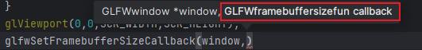

# Start

## 窗口

OpenGL的初始化需要两个第三方库：glfw和glad

**glfw用于窗口的创建。**  #include<GLFW/glfw.h\>

**glad用于在运行时确定OpenGL的函数地址。**因为OpenGL只是一个标准/规范，具体的实现是由驱动开发商针对特定显卡实现的。由于OpenGL驱动版本众多，它大多数函数的位置都无法在编译时确定下来，需要在运行时查询。所以任务就落在了开发者身上，开发者需要在运行时获取函数地址并将其保存在一个函数指针中供以后使用。glad使用了一个在线服务，我们能够告诉GLAD需要定义的OpenGL版本，并且根据这个版本加载所有相关的OpenGL函数。

\#include<glad/glad.h\>

**注意！！必须要在include glfw之前include glad，因为glad的头文件包含了正确的OpenGL头文件，所以需要在其它依赖于OpenGL的头文件之前包含GLAD。**


```c++
	//在调用OpenGL函数之前要先初始化glad
    if (!gladLoadGLLoader((GLADloadproc)glfwGetProcAddress))
    {
        std::cout << "Failed to initialize GLAD" << std::endl;
        return -1;
    }
```

改变窗口大小时，视口也应该被调整。对窗口注册一个**回调函数**

```c++
void framebuffer_size_callback(GLFWwindow* window,int w,int h){
    glViewport(0,0,w,h);
}
```

回调函数只是一个普通的函数，要注册这个函数，通过glfwSetFramebufferSizeCallback()。



可以看出framebuffer_size_callback被定义为GLFWframebuffersizefun 类型的参数。GLFWframebuffersizefun 的定义如下，其是一个函数指针，函数的参数和返回值与framebuffer_size_callback对应，因此当将framebuffer_size_callback作为GLFWframebuffersizefun类型传递给glfwSetFramebufferSizeCallback时，就实现了glfwSetFramebufferSizeCallback对于framebuffer_size_callback函数的调用，而且后期需要改变功能只需要传入其他参数和返回值类型相同的函数即可。

```c++
typedef void(* GLFWframebuffersizefun) (GLFWwindow *, int, int)
```

**添加一个渲染循环，并能接受用户输入**

```c++
while (!glfwWindowShouldClose(window)){
    //双缓冲，避免复杂绘图操作的时候会出现明显的闪烁。程序在后台将图像完整的绘制到后缓冲，再交换前后缓冲的指针
    glfwSwapBuffers(window);
    glfwPollEvents();
}
```

**输入控制**

思想：使用glfwGetKey函数，参数为window和按键，该函数返回值=GLFW_PRESS，说明这个按键正在被按下，放在渲染循环里，每次循环检查一遍就可以。为了表示整洁，把这些放在一个函数里即可。

```c++
void processInput(GLFWwindow* window){
    if(glfwGetKey(window,GLFW_KEY_ESCAPE)==GLFW_PRESS){   //检查用户是否按下Esc键
        glfwSetWindowShouldClose(window,true);
    }
}
```

使用一个颜色每次渲染完清空屏幕

```c++
	glClearColor(0.2f,0.3f, 0.3f, 1.0f);    //设置 用什么颜色去清空color buffer 因为只用设置一次 可以放在循环外面
    while (!glfwWindowShouldClose(window)){
        processInput(window);
        glClear(GL_COLOR_BUFFER_BIT);       //这一步才是真的清空了 每次循环结束都要清空，因此放在循环里面
        glfwSwapBuffers(window);
        glfwPollEvents();
    }
```

## 绘制一个三角形

绘制需要顶点信息和着色器，先来聊着色器

### 着色器

- 编写顶点着色器和片段着色器

  - 着色器在.vert和.frag文件中编写
  - 要用文件读取进来，用const char*指向

- 编译两个着色器

- 链接两个着色器

根据以上信息，创建一个shader类

```c++
class Shader
{
public:
    // 程序ID
    unsigned int ID;

    // 构造函数读取并构建着色器
    Shader(const char* vertexPath, const char* fragmentPath);
    // 使用/激活程序
    void use();
    // uniform工具函数
    void setBool(const std::string &name, bool value) const;  
    void setInt(const std::string &name, int value) const;   
    void setFloat(const std::string &name, float value) const;
};
```

构造函数的任务是读取着色器文件和编译链接

**读取**

```c++
//1.需要一个string存放code
//2.从ifstream中读到stringstream，再从stringstream中获取
string vertexCode;
ifstream vertexShaderFile;
// 保证ifstream对象可以抛出异常：
vertexShaderFile.exceptions (std::ifstream::failbit | std::ifstream::badbit);
try{
     vertexShaderFile.open(vertexPath);
     stringstream vShaderStream;
     vShaderStream<<vertexShaderFile.rdbuf();
     vertexCode = vShaderStream.str();
     vertexShaderFile.close();
}catch (ifstream::failure e){
    std::cout << "ERROR::SHADER::FILE_NOT_SUCCESFULLY_READ" << std::endl;
}
const char* vShaderCode = vertexCode.c_str();
//frag同理
```

//编译链接

```c++
//编译
GLuint glCreateShader(GLenum shaderType);
//创建一个空的着色器对象，参数shaderType指定要创建的着色器类型，只能是 GL_VERTEX_SHADER 或 GL_FRAGMENT_SHADER，返回一个shaderId
void glShaderSource(GLuint shader,GLsizei count,const GLchar **string,const GLint *length);
//把着色器代码放进一个shader对象中。参数1：要放入的shaderId；参数2：传递的源码字符"串"数量；参数3：着色器真正的源码；
void glCompileShader(GLuint shader);
//编译一个着色器对象
void glGetShaderiv(GLuint shader,GLenum pname,GLint *params);
//检测着色器对象编译是否成功。
//参数2：仅接受GL_SHADER_TYPE, GL_DELETE_STATUS, GL_COMPILE_STATUS, GL_INFO_LOG_LENGTH,GL_SHADER_SOURCE_LENGTH.
//参数3：params是函数返回的，要给其传入一个int引用，为0代表编译成功，否则编译失败
void glGetShaderInfoLog(GLuint shader,GLsizei maxLength,GLsizei *length,GLchar *infoLog);
//函数由infoLog返回编译失败时的输出信息，给infoLog传入char数组

//链接
GLuint glCreateProgram(void);
//创建一个着色器程序对象，返回programId。
void glAttachShader(GLuint program,GLuint shader);
//把shader对象attach到program对象上
void glLinkProgram(	GLuint program);
//顶点和片段连接起来
```

```c++
//编译
unsigned int vertex,fragment;
int success;
char infoLog[512];
vertex = glCreateShader(GL_VERTEX_SHADER);
glShaderSource(vertex,1,&vShaderCode, nullptr);
glCompileShader(vertex);
glGetShaderiv(vertex,GL_COMPILE_STATUS,&success);
if(!success){
    glGetShaderInfoLog(vertex, 512, NULL, infoLog);
    cout << "ERROR::SHADER::VERTEX::COMPILATION_FAILED\n" << infoLog << endl;
}
```

```c++
//链接
        ID=glCreateProgram();
        glAttachShader(ID,vertex);
        glAttachShader(ID,fragment);
        glLinkProgram(ID);
        glGetProgramiv(ID,GL_LINK_STATUS,&success);
        if(success){
            glGetProgramInfoLog(ID,512,NULL,infoLog);
            cout << "ERROR::PROGRAM::LINK_FAILED\n" << infoLog << endl;
        }

//链接完毕之后就可以删除原着色器对象了
        glDeleteShader(vertex);
        glDeleteShader(fragment);
```

## glDrawArrays 和 glDrawElements

glDrawArrays：从data数组中渲染图元。适用于没有使用EBO的情况

```c++
void glDrawArrays(GLenum mode,GLint first,GLsizei count);
//mode:指定要绘制什么图元，可接受GL_POINTS, GL_LINE_STRIP, GL_LINE_LOOP, GL_LINES, GL_LINE_STRIP_ADJACENCY, GL_LINES_ADJACENCY, 		  GL_TRIANGLE_STRIP, GL_TRIANGLE_FAN, GL_TRIANGLES, GL_TRIANGLE_STRIP_ADJACENCY, GL_TRIANGLES_ADJACENCY和GL_PATCHES 这几个参数
//first：从array中的first下标顶点开始绘制
//count：一共要绘制count个顶点
```

glDrawElements：也是从data数组中渲染图元，适用于有EBO的情况

```c++
void glDrawElements(GLenum mode,GLsizei count,GLenum type,const void * indices);
//mode:同glDrawArrays
//count:同glDrawArrays
//type:指定indices中的数据类型，必须是GL_UNSIGNED_BYTE, GL_UNSIGNED_SHORT, or GL_UNSIGNED_INT
//indices:先写成0
```


参考：

https://blog.csdn.net/Treeman5433716/article/details/80609119