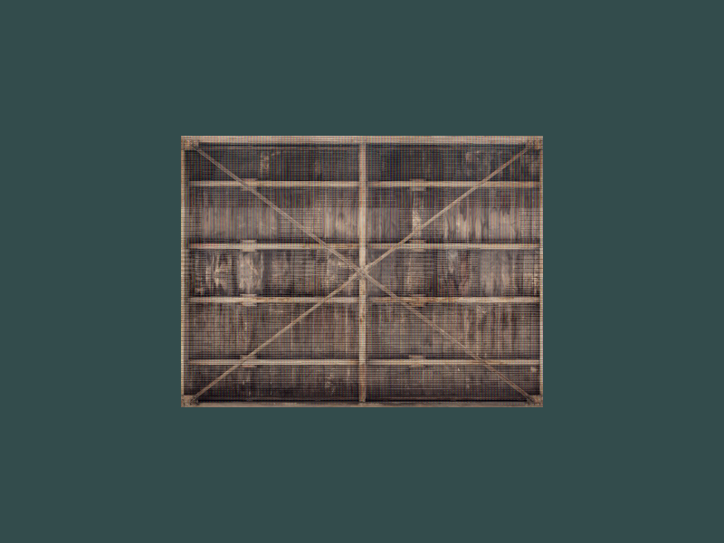
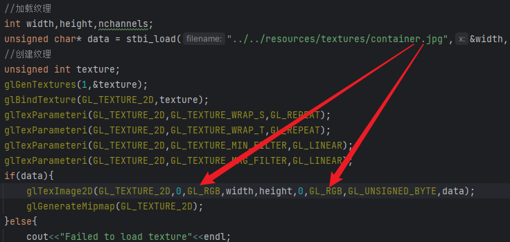
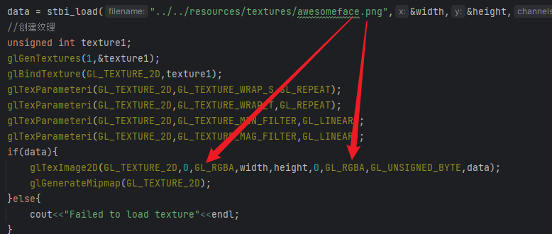
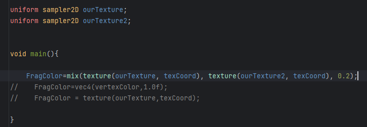

# texture

## 纹理坐标映射

纹理坐标在x和y轴上，范围为0到1之间,纹理坐标起始于(0, 0)，也就是纹理图片的左下角，终始于(1, 1)，即纹理图片的右上角。现在要给每个顶点设置一个纹理坐标。顶点和纹理坐标的关系如下图


把纹理坐标加入顶点数组中，再加一条顶点属性指针函数glVertexAttribPointer来解析新数组即可。

```c++
	float vertices[]={
            // 位置              // 颜色             //纹理
            0.5f, -0.5f, 0.0f,  1.0f, 0.0f, 0.0f,  1.0f,0.0f,  // 右下
           -0.5f, -0.5f, 0.0f,  0.0f, 1.0f, 0.0f,  0.0f,0.0f,  // 左下
            0.0f,  0.5f, 0.0f,  0.0f, 0.0f, 1.0f,  0.5f,1.0f   // 顶部
    };

    unsigned int VAO,VBO;
    glGenVertexArrays(1,&VAO);
    glBindVertexArray(VAO);
    glGenBuffers(1,&VBO);
    glBindBuffer(GL_ARRAY_BUFFER,VBO);
    glBufferData(GL_ARRAY_BUFFER,sizeof(vertices),vertices,GL_STATIC_DRAW);
    glVertexAttribPointer(0,3,GL_FLOAT,GL_FALSE,8*sizeof(float),(void*)0);
    glEnableVertexAttribArray(0);
    glVertexAttribPointer(1,3,GL_FLOAT,GL_FALSE,8*sizeof(float),(void*)(3*sizeof(float)));
    glEnableVertexAttribArray(1);
    glVertexAttribPointer(2,2,GL_FLOAT,GL_FALSE,8*sizeof(float),(void*)(6*sizeof(float)));
    glEnableVertexAttribArray(2);
```

给每个点设置好纹理坐标之后，接下来就是加载并设置纹理图片了

## 加载创建纹理

纹理图像可能是jpg , png等格式，因此我们需要一个工具，把各种各样的图片读取并转换成字节序列，这里使用stb_image.h库。

```c++
//加载纹理
int width,height,nchannels;
unsigned char* data = stbi_load("../../resources/textures/container.jpg",&width,&height,&nchannels,0);
//参数1：图像的路径；2，3，4：stb_image.h将会用图像的宽度、高度和颜色通道的个数填充这三个变量；5：先填0
```

创建纹理

同VBO的创建很类似，注意绑定到的**纹理目标**是什么

```c++
	//创建纹理
    unsigned int texture;
    glGenTextures(1,&texture);
    glBindTexture(GL_TEXTURE_2D,texture);

    glTexParameteri(GL_TEXTURE_2D,GL_TEXTURE_WRAP_S,GL_REPEAT);
    glTexParameteri(GL_TEXTURE_2D,GL_TEXTURE_WRAP_T,GL_REPEAT);
    glTexParameteri(GL_TEXTURE_2D,GL_TEXTURE_MIN_FILTER,GL_LINEAR);
    glTexParameteri(GL_TEXTURE_2D,GL_TEXTURE_MAG_FILTER,GL_LINEAR);

    if(data){  //注意要判断一下data是否有效
        glTexImage2D(GL_TEXTURE_2D,0,GL_RGB,width,height,0,GL_RGB,GL_UNSIGNED_BYTE,data);
        glGenerateMipmap(GL_TEXTURE_2D);
    }else{
        cout<<"Failed to load texture"<<endl;
    }
    stbi_image_free(data);//注意data使用完之后要销毁

void glTexImage2D(GLenum target,GLint level,GLint internalformat,GLsizei width,GLsizei height,GLint border,GLenum format,
                  GLenum type,const void * data);
//target：纹理目标，会生成与当前绑定在该纹理目标上的纹理。
//level：mipmap的等级，填0表示level 0
//internalformat：指定了纹理在显存中的格式，一般填GL_RGB
//width,height：指定了纹理的宽高
//border：总是为0(历史遗留问题)
//format,type：源图的格式和数据类型
//data：数据指针

//将param的值赋值给target中pname名字的变量
void glTexParameteri(GLenum target,GLenum pname,GLint param);

//glGenerateMipmap为绑定在目标GL_TEXTURE_2D上的纹理自动生成所有需要的多级渐远纹理。
```

创建好纹理之后，如何将纹理与shader联系起来？用纹理单元

### 纹理单元

一个纹理在片段着色器中的location(位置值)通常被称为纹理单元，一个纹理的默认纹理单元是GL_TEXTURE0，默认被激活。严格来讲，当我们使用glBindTexture函数之前，要先激活一个纹理单元，glBindTexture会绑定这个纹理到激活的纹理单元中。但是GL_TEXTURE0总是默认被激活，因此我们之前的操作不需要激活纹理单元。

在片段着色器里添加一个采样器sampler，可以以纹理类型作为后缀，比如sampler1D、sampler2D、sampler3D。并将其声明为uniform变量

```c++
#version 330 core
out vec4 FragColor;
in vec3 vertexColor;
in vec2 texCoord;

uniform sampler2D ourTexture;

void main(){
    FragColor=texture(ourTexture,texCoord);
}
```

再用内建的texture函数对其采样就行。

## 多目标纹理的情况

把纹理的创建和设置分开写，结果是这样的



耗了一下午，发现问题是stb_image.h库对于jpg格式的图片，源数据格式和目标数据格式都要用GL_RGB：



对于png格式的图片，源数据格式和目标数据格式要用GL_RGBA：



下面说一下怎么利用多张(2张)纹理：

创建阶段和上面相同，注意data、width、height和nchannels可以复用，没必要声明新变量。

shader内声明两个uniform sampler2D变量，取不同的名字



在渲染循环之前，还要通过使用glUniform1i设置每个采样器的方式告诉OpenGL每个着色器采样器属于哪个纹理单元，只需设置一次，注意在给uniform传参的时候，要保证shader在启动状态，所以：
```c++
    shader.use();
    shader.setInt("ourTexture",0);
    shader.setInt("ourTexture2",1);
```

最后，在渲染循环里激活并绑定两个texture。因为GL_TEXTURE_2D一次只能绑在一个texture上面，绑定texture1的时候，texture自动解绑，所以要把它们放在渲染循环中。

```c++
    glActiveTexture(GL_TEXTURE0);
    glBindTexture(GL_TEXTURE_2D,texture);
    glActiveTexture(GL_TEXTURE1);
    glBindTexture(GL_TEXTURE_2D,texture1);
```

