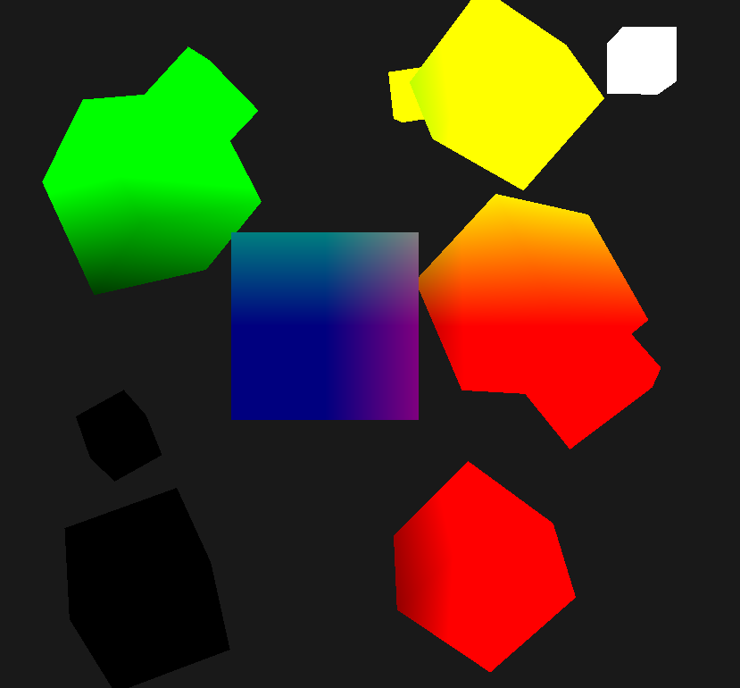
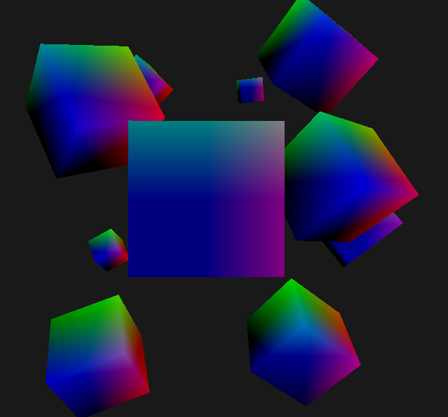
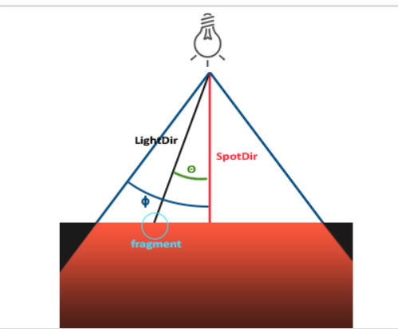
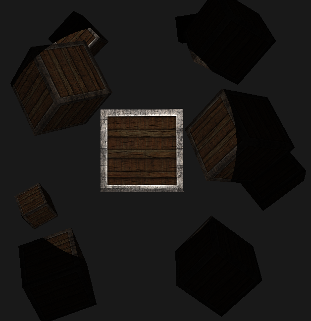
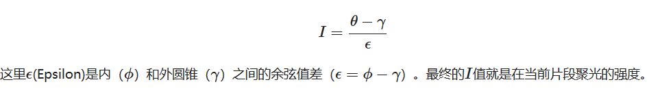

# color&基础光照

定义物体的颜色为**物体从一个光源反射各个颜色分量的大小**。

```c++
glm::vec3 result = lightColor * toyColor; 
```

### 将光源显示为可见的物体-cube

我们现在已经有了立方体的数据了(存在VBO中)，代表光源的cube(以下简称light_cube)不需要纹理，只需要一个颜色值来代表光源是什么颜色，也不需要有额外的光照效果，再把它移动缩放到合适的位置就可以了。为了方便一点且能区分light_cube和场景中的物体，我们新建一个lightVAO和一个shader

```c++
unsigned int lightVAO;
{
    glGenVertexArrays(1,&lightVAO);
    glBindVertexArray(lightVAO);
    glBindBuffer(GL_ARRAY_BUFFER,VBO);
    glVertexAttribPointer(0,3,GL_FLOAT,GL_FALSE,5*sizeof(float),(void*)0);
    glEnableVertexAttribArray(0);
    glBindVertexArray(0);
}
```

shader很简单。vertex中做mvp变换；fragment中把颜色直接return出去；

```glsl
//vertex shader
#version 330 core
layout(location=0) in vec3 aPos;
uniform mat4 model;
uniform mat4 view;
uniform mat4 projection;
void main() {
    gl_Position = projection*view*model*vec4(aPos,1.f);
}

//fragment shader
#version 330 core
uniform vec3 lightColor;
void main() {
    gl_FragColor=vec4(lightColor,1.f);
}
```

### 计算光照效果——blinn phone

ambient分量：常数*lightColor

```glsl
float ambientStrength=0.1;
vec3 ambient = ambientStrength*lightColor;
```

diffuse分量：max(0,n·l)*lightColor，计算都在world坐标系

```glsl
//顶点着色器中
fragpos = (model*vec4(aPos,1.f)).xyz;
//片段着色器中  (lightPos由uniform传入)
vec3 lightDir = normalize(lightPos-fragpos);
float diff = max(0.f,dot(lightDir,Normal));
vec3 diffuse = diff*lightColor;
```

specular分量：常数 * pow(max(0,n·h),32) * lightColor

```glsl
//viewPos由uniform传入，不需要进行m变换，因为viewPos本身就在world坐标系中了
vec3 viewDir = normalize(viewPos-fragpos);
vec3 h = normalize(viewDir+lightDir);
float spec = pow(max(0.f,dot(h,Normal)),32);
float specStrength = 0.5f;
vec3 specular = specStrength*spec*lightColor;
```

最后加在一起就行了

```glsl
vec3 result = (ambient+diffuse+specular)*objColor;
fragColor=vec4(result,1.f);
```

### 在view空间进行blinn phone计算

在顶点着色器中把光源位置转换到view空间

```glsl
Lightpos = mat3(view)*lightPos;
```

```glsl
//片段着色器
vec3 viewDir = normalize(vec3(0.f,0.f,0.f)-fragpos);
```

viewDir的计算直接用原点-fragpos，因为在view空间摄像机在原点

## 投光物（light caster）

### 点光源

顶点着色器中

```glsl
void main() {
    gl_Position = projection*view*model*vec4(aPos,1.f);
    Normal = vec3(transpose(inverse(model))*vec4(aNormal,1.f));
    texCoord=aTexcoord;
//    fragPos = mat3(model)*aPos;   //注意，不要这么写！
    fragPos = vec3(model * vec4(aPos, 1.0));
}
```

mat3(model)把 model 矩阵的第4列和第4行去掉。但是有平移操作的model矩阵，位移放在第4列中，强行去掉显然是不对的。

正确的fragPos值：



错误的fragPos值



另外，光在传播过程中亮度会衰减，因此要计算一个衰减值。这里用$a+bx+cx^2$，其中a,b,c是传进去的参数，x是shading point和光源的距离。

```glsl
	float dist = length(light.position-fragPos);	
	float attanuation = 1.f/(light.constant+light.linear*dist+light.quadratic*dist*dist);
	……
    ambient *= attanuation;
    diffusion *= attanuation;
    specular *= attanuation;
```

### 聚光



聚光需要额外定义：1.聚光所指向的方向(spotDir)；2.切光角(cutoff)。当光源指向shading point的向量，也就是lightDir，和spotDir之间的夹角小于切光角时，物体可以被照亮；大于，就不能被照亮。

有了夹角的概念，显然要利用向量点乘计算夹角之间的cos值，再与cutoff的cos值进行比较。注意：1.cos函数在0~$\pi$ 是单调递减函数；2.着色器中计算三角函数比较浪费，所以在主程序中计算好cos(cutoff)，再传进去；

为了达到聚光随视角移动的效果，position是camera的position；direction是camera的front向量。

```glsl
struct spotLight{
    vec3 position;
    vec3 diffuse;
    vec3 specular;
    vec3 ambient;

    float constant;
    float linear;
    float quadratic;

    float cutoff;      //cos(切光角)
    vec3 direction;    
};


if(dot(lightDir,normalize(-light.direction)) > light.cutoff){
    float diff = max(0.f,dot(lightDir,n));
    diffusion = diffuseColor*diff*light.diffuse;

    vec3 h = normalize(viewDir+lightDir);
    float spec = pow(max(0.f,dot(n,h)),material.shininess);
    specular = texture(material.specularMap,texCoord).rgb*spec*light.specular;
}else{
    diffusion=vec3(0.0,0.0,0.0);
    specular=vec3(0.0,0.0,0.0);
}
```

最后效果是这样的：



### soft spotlight

上面的聚光效果边缘过于锐利，原因是片段的亮度值 乘上了个非0即1的数。现在我们需要一个效果，使得片段的亮度在边缘处递减为0。方法是用内外两个切光角，当angle在内切光角以内时，亮度*1；内切光角<angle<外切光角，亮度 * 一个小数；angle>外切光角，亮度*0；因此，用angle在内、外切光角之间插值就行，内切光角上值为1，外切光角值为0，线性插值



```glsl
float theta = dot(lightDir,normalize(-light.direction));
float epsilon = light.innerCutoff - light.outerCutoff;
float intensity = clamp((theta-light.outerCutoff)/epsilon,0.0,1.0);
```

（其实任何一种插值方法都可以，看你喜欢哪种）