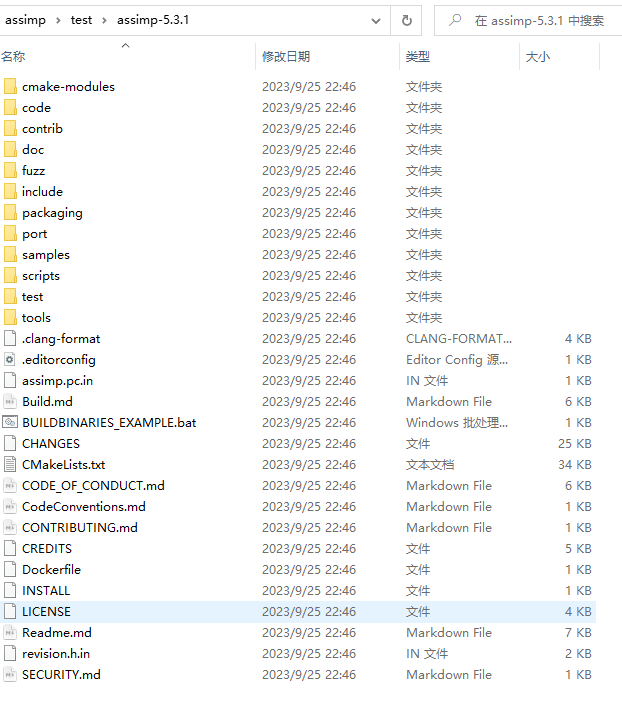
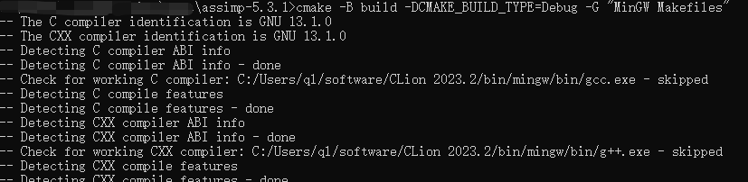
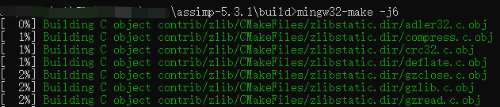
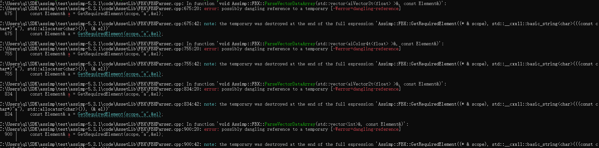
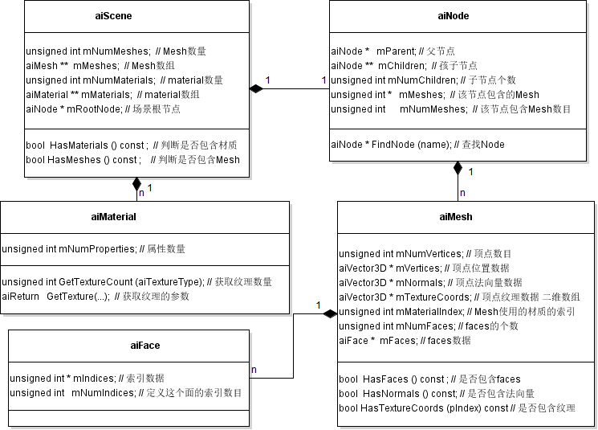

# Assimp

## 编译

下载源码：[Release The 5.3.1 Bugfix Release · assimp/assimp (github.com)](https://github.com/assimp/assimp/releases/tag/v5.3.1)此链接为5.3.1版，解压到本地



使用命令**cmake -B build -DCMAKE_BUILD_TYPE=Debug -G "MinGW Makefiles"** 



-B    指定构建的项目文件所在的目录。 -B build就是在当前文件夹下新建一个build文件夹，把构建的项目文件全部放里面。

-G    Generator 的意思，该语句可以设置 IDE，现在选的IDE就是"MinGW Makefiles"

-D    debug模式还是release模式

cmake 支持的 IDE 如下：

- Borland Makefiles: 生成 Borland makefile。

- MSYS Makefiles: 生成 MSYS makefile。
  生成的 makefile 用 use /bin/sh 作为它的 shell。在运行 CMake 的机器上需要安装msys。

- MinGW Makefiles: 生成供 mingw32-make 使用的 make file。
  生成的 makefile 使用 cmd.exe 作为它的 shell。生成它们不需要 msys 或者 unix shell。

- NMake Makefiles: 生成 NMake makefile。

- NMake Makefiles JOM: 生成 JOM makefile。

- Unix Makefiles: 生成标准的 UNIX makefile。
  在构建树上生成分层的 UNIX makefile。任何标准的 UNIX 风格的 make 程序都可以通过默认的 make 目标构建工程。生成的 makefile 也提供了 install 目标。

- Visual Studio 10: 生成 Visual Studio 10 工程文件。
  Visual Studio 10 Win64: 生成 Visual Studio 10 Win64 工程文件。
  Visual Studio 6: 生成 Visual Studio 6 工程文件。
  Visual Studio 7: 生成 Visual Studio .NET 2002 工程文件。
  Visual Studio 7 .NET 2003: 生成 Visual Studio .NET 2003 工程文件。
  Visual Studio 8 2005: 生成 Visual Studio .NET 2005 工程文件。
  Visual Studio 8 2005 Win64: 生成 Visual Studio .NET 2005 Win64 工程文件。
  Visual Studio 9 2008: 生成 Visual Studio 9 2008 工程文件。
  Visual Studio 9 2008 Win64: 生成 Visual Studio 9 2008 Win64 工程文件。
  Watcom WMake: 生成 Watcom WMake makefiles。
  CodeBlocks - MinGW Makefiles: 生成 CodeBlock 工程文件。
  在顶层目录以及每层子目录下为 CodeBlocks 生成工程文件，生成的 CMakeList.txt 的特点是都包含一个 PROJECT() 调用。除此之外还会在构建树上生成一套层次性的 makefile。通过默认的 make 目标，正确的 make 程序可以构建这个工程。makefile 还提供了 install 目标。

- CodeBlocks - NMake Makefiles: 生成 CodeBlocks 工程文件。
  在顶层目录以及每层子目录下为 CodeBlocks 生成工程文件，生成的 CMakeList.txt 的特点是都包含一个 PROJECT() 调用。除此之外还会在构建树上生成一套层次性的 makefile。通过默认的 make 目标，正确的 make 程序可以构建这个工程。makefile 还提供了 install 目标。

- CodeBlocks - Unix Makefiles: 生成CodeBlocks工程文件。
  在顶层目录以及每层子目录下为CodeBlocks生成工程文件，生成的CMakeList.txt的特点是都包含一个PROJECT()调用。除此之外还会在构建树上生成一套层次性的makefile。通过默认的make目标，正确的make程序可以构建这个工程。makefile还提供了install目标。

- Eclipse CDT4 - MinGW Makefiles: 生成 Eclipse CDT 4.0 工程文件。
  在顶层目录下为 Eclipse 生成工程文件。在运行源码外构建时，一个连接到顶层源码路径的资源文件会被创建。除此之外还会在构建树上生成一套层次性的 makefile。通过默认的 make 目标，正确的 make 程序可以构建这个工程。makefile 还提供了 install 目标。

- Eclipse CDT4 - NMake Makefiles: 生成 Eclipse CDT 4.0 工程文件。
  在顶层目录下为 Eclipse 生成工程文件。在运行源码外构建时，一个连接到顶层源码路径的资源文件会被创建。除此之外还会在构建树上生成一套层次性的 makefile。通过默认的 make 目标，正确的 make 程序可以构建这个工程。makefile 还提供了 install 目标。

- Eclipse CDT4 - Unix Makefiles: 生成 Eclipse CDT 4.0 工程文件。
  在顶层目录下为 Eclipse 生成工程文件。在运行源码外构建时，一个连接到顶层源码路径的资源文件会被创建。除此之外还会在构建树上生成一套层次性的 makefile。通过默认的 make 目标，正确的 make 程序可以构建这个工程。makefile 还提供了 install 目标。

构建完之后，要编译项目。

进入build文件夹，执行命令**mingw32-make -j8**；或者不进入build文件夹，执行命令**cmake --build build -j8**。



-j8的意思是使用8个线程来编译，我自己的电脑最多有6个线程，所以我用的 -j6。

cmake --build build 的含义是：执行build文件夹下的构建系统，生成构建目标。

编译过程会报这个错误：**[-Werror=dangling-reference]**



一种方法是把g++的版本改为12；另一种方法是把error改成warming，不让它报错就可以了！在CMakelists.txt文件的131行添加**SET(ASSIMP_WARNINGS_AS_ERRORS FALSE)**

然后就可以顺利编译了。编译完成后会在build/bin目录下有一个**libassimp-5d.dll**文件，复制到自己的lib文件夹下。注意这是动态库，cmake只管编译不管运行，所以为了让程序能在运行的时候动态的链接到这个库，还需要把lib文件夹的路径放到path环境变量中。

最后在顶层CMakelist.txt文件里link到这个库

```txt
link_libraries(assimp-5d)
```

## 使用

读取数据

```c++
Assimp::Importer importer;
const aiScene* scene = importer.ReadFile(path, aiProcess_Triangulate | aiProcess_GenSmoothNormals | aiProcess_FlipUVs | aiProcess_CalcTangentSpace);
// check for errors
if(!scene || scene->mFlags & AI_SCENE_FLAGS_INCOMPLETE || !scene->mRootNode) // if is Not Zero
{
    cout << "ERROR::ASSIMP:: " << importer.GetErrorString() << endl;
    return -1;
}
```

AssImp的主要的类如下图所示：



- **aiScene 作为AssImp加载模型的根数据结构，保存了从模型加载的顶点位置、法向量、纹理、光照等数据**，例如它通过数组mMeshes保存Mesh数据，通过mMaterials保存材质数据。总之aiScene保存了加载的模型数据，其余类通过索引aiScene中存储的对象来获取对应的数据。

- aiNode 模型通过层次结构存储，根节点mRootNode保存在aiScene中，根节点下面有0至多个子节点，每个节点通过aiNode类表达，aiNode中包含一个或者多个Mesh，注意**这里的Mesh是对aiScene中Mesh数据的一个索引**。

- aiMesh是上一节中所讲的Mesh对象，Mesh中包含顶点位置数据、法向量、纹理数据，每个Mesh可以包含一个或者多个Face。

- aiFace是一个面，一般来讲在读取模型时通过后处理选项(post-process flag)将模型转换为三角形网格，那么这里的面主要是三角形面。后处理选项稍后介绍。通过三角形面，我们可以获取渲染模型需要的索引数据。


 


参考：https://blog.csdn.net/wangdingqiaoit/article/details/52014321
