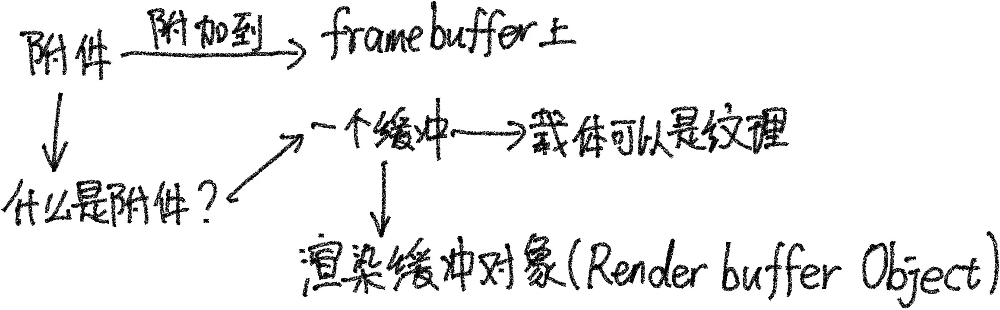

# Framebuffer

帧缓冲的定义：颜色缓冲+深度缓冲+模板缓冲+……，这一系列的缓冲称为帧缓冲。我们之前使用的是OpenGL的默认的一套缓冲，有了framebuffer我们可以使用自己定义的，这样的好处是便于实现各种各样后期处理的效果！

完整的帧缓冲要满足如下条件：

- 附加至少一个缓冲（颜色、深度或模板缓冲）。

- 至少有一个颜色附件(Attachment)。

- 所有的附件都必须是完整的（保留了内存）。

- 每个缓冲都应该有相同的样本数。

创建framebuffer：

```c++
unsigned int framebuffer;
glGenFramebuffers(1, &framebuffer);
glBindFramebuffer(GL_FRAMEBUFFER, framebuffer);
```



纹理：像之前一样创建，format填GL_RGB，data填null生成一个空纹理，纹理的大小设为视口的大小。生成完毕之后要绑定到framebuffer中

```c++
// 生成纹理
unsigned int texColorBuffer;
glGenTextures(1, &texColorBuffer);
glBindTexture(GL_TEXTURE_2D, texColorBuffer);
glTexImage2D(GL_TEXTURE_2D, 0, GL_RGB, 视口的宽, 视口的高, 0, GL_RGB, GL_UNSIGNED_BYTE, NULL);
glTexParameteri(GL_TEXTURE_2D, GL_TEXTURE_MIN_FILTER, GL_LINEAR );
glTexParameteri(GL_TEXTURE_2D, GL_TEXTURE_MAG_FILTER, GL_LINEAR);
glBindTexture(GL_TEXTURE_2D, 0); //解绑texture,随后是texColorBuffer绑定到帧缓冲对象，不是GL_TEXTURE_2D

// 将它附加到当前绑定的帧缓冲对象
glFramebufferTexture2D(GL_FRAMEBUFFER, GL_COLOR_ATTACHMENT0, GL_TEXTURE_2D, texColorBuffer, 0);  
```

**渲染缓冲对象(Renderbuffer Object)**是在纹理之后引入到OpenGL中，作为一个可用的帧缓冲附件类型，在过去纹理是唯一可用的附件。

```c++
unsigned int rbo;
glGenRenderbuffers(1, &rbo);
glBindRenderbuffer(GL_RENDERBUFFER, rbo); 
glRenderbufferStorage(GL_RENDERBUFFER, GL_DEPTH24_STENCIL8, 视口的宽, 视口的高);  
glBindRenderbuffer(GL_RENDERBUFFER, 0);//解绑rbo

//绑定到framebuffer
glFramebufferRenderbuffer(GL_FRAMEBUFFER, GL_DEPTH_STENCIL_ATTACHMENT, GL_RENDERBUFFER, rbo);

//检查当前fbo是否完整
if(glCheckFramebufferStatus(GL_FRAMEBUFFER) != GL_FRAMEBUFFER_COMPLETE)
    std::cout << "ERROR::FRAMEBUFFER:: Framebuffer is not complete!" << std::endl;
glBindFramebuffer(GL_FRAMEBUFFER, 0);//解绑fbo
```

rbo是一个真正的缓冲，它会把数据存储为OpenGL原生的渲染格式。这样的好处是复制它的数据到其它的缓冲非常快，坏处是不能使用**纹理访问的形式**读取其中的数据。一般来说，**需要采样附件中的数据时，使用纹理；不需要采样，使用rbo。**

例子：先渲染场景到自定义的fbo，再把fbo中的颜色渲染到一个覆盖了屏幕的四边形上。

注意：渲染四边形只需要其x和y的值，因此quadVertices[]中三角形的position不需要定义z值，另外再定义纹理坐标即可。

```c++
//渲染四边形的shader
#version 330 core
layout (location = 0) in vec2 aPos;
layout (location = 1) in vec2 aTexCoords;

out vec2 TexCoords;

void main()
{
    gl_Position = vec4(aPos.x, aPos.y, 0.0, 1.0); 
    TexCoords = aTexCoords;
}


float quadVertices[]={
    //pos  texcoord
    -1,-1, 0,0,
    1,-1,  1,0,
    1,1,   1,1,
    
    1,1,   1,1,
    -1,1,  0,1,
    -1,-1  0,0
}
unsigned int VAO,VBO;//场景
{
    ......
}

unsigned int quadVAO,quadVBO;
{
    ......
}

while(窗口没关闭){
    //第一个pass
    glBindFramebuffer(GL_FRAMEBUFFER, framebuffer);//把输出绑定到自定义framebuffer上
    glClearColor(0.1f, 0.1f, 0.1f, 1.0f);
	glClear(GL_COLOR_BUFFER_BIT | GL_DEPTH_BUFFER_BIT); // 我们现在不使用模板缓冲
	glEnable(GL_DEPTH_TEST);
    glBindVertexArray(VAO);
    渲染场景
        
    //第二个pass
    glBindFramebuffer(GL_FRAMEBUFFER, 0);//把输出绑定到默认的framebuffer上
    glClearColor(0.1f, 0.1f, 0.1f, 1.0f);
    glClear(GL_COLOR_BUFFER_BIT);
    lDisable(GL_DEPTH_TEST);//不需要深度测试了
    glBindVertexArray(quadVAO);
    渲染到四边形
}
```

### 后期处理

后期处理的定义：


**着色器中不能使用多维数组**
