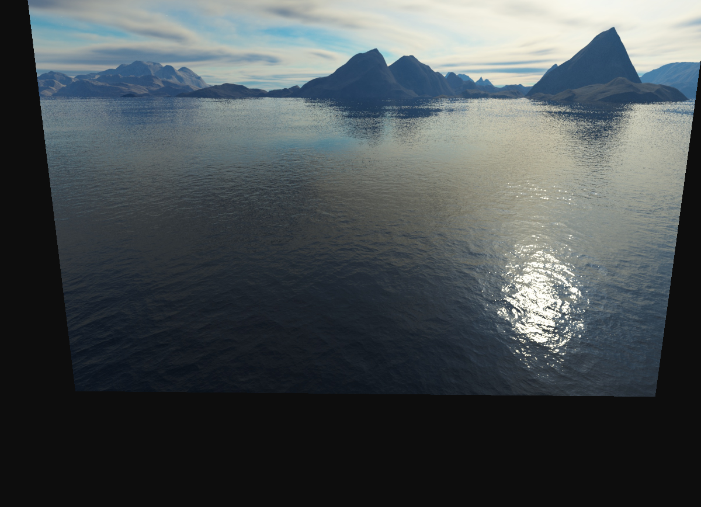
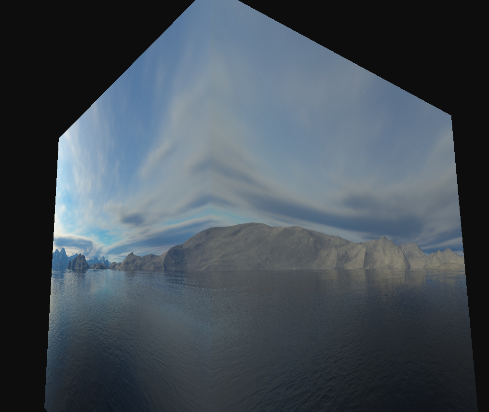
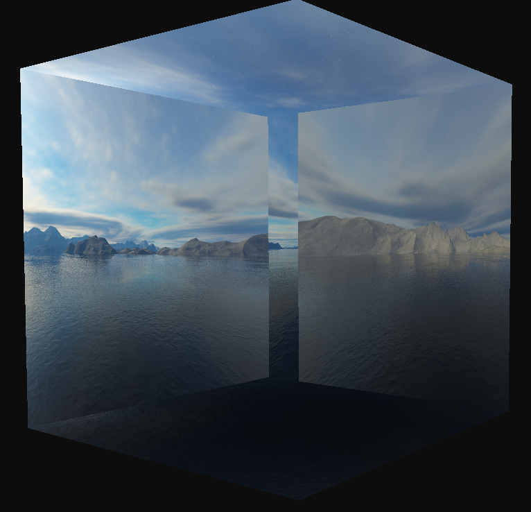
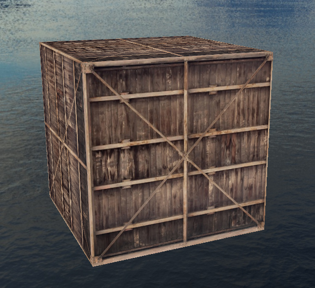
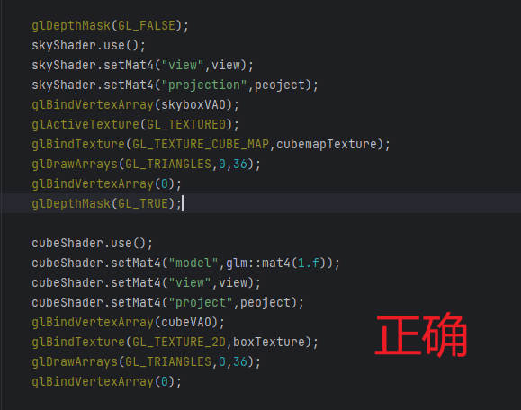

# cubemaps



这样的原因是没有关闭深度写入。移动一下相机就可以看到



关闭深度写入之后，



另外，关闭深度写入是为了让天空盒永远绘制在其它物体的背后。

感觉相机在天空盒外面，这样的原因是，绘制天空盒的shader，传进去的view矩阵有位移部分，把相机移出了天空盒，所以要去掉view矩阵中的位移部分。方法是去掉矩阵的第三行和第三列：

```glsl
//在shader中
vec4 pos = projection*vec4(mat3(view)*aPos,1.f);
//或在应用程序中
glm::mat4 view = glm::mat4(glm::mat3(camera.GetViewMatrix()));
```

再在场景中添加一个box，流程和之前一样



问题来了，box在天空盒之后渲染才能被正确显示；若在天空盒之前渲染则box不会被显示出来

