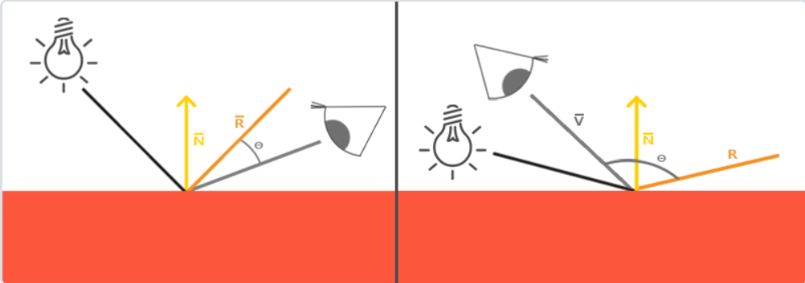

# blinnPhong

复习一下phong氏光照模型：

**ambient = ambientStrength * lightColor;**

**diffuse =  max(dot(normal, lightDir), 0.0) * lightColor;**

**specular = specularStrength *  pow(max(dot(viewDir, reflectDir), 0.0), Shininess)* lightColor;**

phone氏光照模型有个问题，当viewDir和reflectDir的夹角大于90°时，specular分量等于0。如下图所示：

根据右图，观察方向离反射方向很远，按道理来说接收不到任何高光并没有什么问题。但是当物体的反光度，也就是Shininess，很小的时候产生的镜面高光面积很大，这种情况下不能忽略镜面高光对物体亮度的贡献。对其进行改进，引入blinn-phong光照模型。

**specular = specularStrength *  pow(max(dot(normal, half), 0.0), Shininess)* lightColor;**

使用法线和半程向量之间的夹角来度量，因为不论观察者向哪个方向看，半程向量与表面法线之间的夹角都不会超过90度。