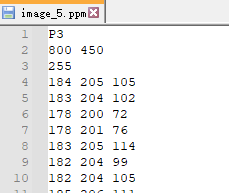
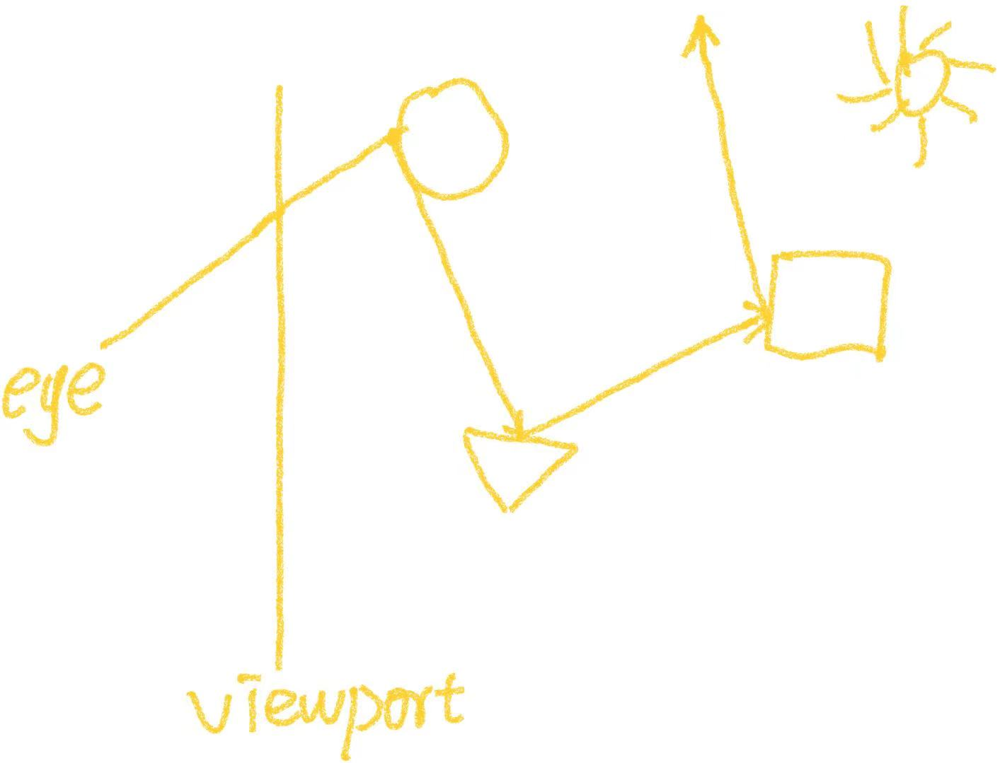

# In One Weekend

# 1.项目介绍

本项目是github上的一个光线追踪项目：不借助任何第三方库实现的光线追踪器。这里重点记录我在实现这个光线追踪器的时候遇到的困难以及自己的思考和总结。

项目地址：https://github.com/RayTracing/raytracing.github.io/

# 2.输出一张图片

### 2.1.ppm图片格式

用notepad++打开一张ppm格式的图片可以看到：



第一行是P3，表示一个颜色由几个分量组成；

第二行是图片的宽和高；

第三行是 max color，表示一个颜色分量的最大值

### 2.2.输出到图片

用输出重定向rdbuf，把输出定向到文件。

```c++
ofstream fout("image_6.ppm"); //文件输出流对象
streambuf* pOld = std::cout.rdbuf(fout.rdbuf());
......
std::cout.rdbuf(pOld); //程序末尾恢复重定向输出
```

## 3.vec3 class类

这个类有3个部分，分别是

1. 成员变量和成员方法
2. 关于向量计算的一些实用函数
3. 关于颜色的实用函数

```c++
class vec3 {
public:
    vec3() : e{ 0,0,0 } {}
    vec3(double e0, double e1, double e2) : e{ e0, e1, e2 } {}
    double x() const { return e[0]; }
    double y() const { return e[1]; }
    double z() const { return e[2]; }
    //类内重载 默认为inline函数
    vec3 operator-() const { return vec3(-e[0], -e[1], -e[2]); }
    double operator[](int i) const { return e[i]; }
    double& operator[](int i) { return e[i]; }
    vec3& operator+=(const vec3& v) {
        e[0] += v.e[0];
        e[1] += v.e[1];
        e[2] += v.e[2];
        return *this;
    }
    vec3& operator*=(const double t) {
        e[0] *= t;
        e[1] *= t;
        e[2] *= t;
        return *this;
    }
    vec3& operator/=(const double t) {
        return *this *= 1 / t;
    }
    double length() const {
        return sqrt(length_squared());
    }
    double length_squared() const {
        return e[0] * e[0] + e[1] * e[1] + e[2] * e[2];
    }
    bool near_zero() {
        auto a = 1e-8;
        return (fabs(e[0]) < a) && (fabs(e[1]) < a) && (fabs(e[2]) < a);
    }
private:
    double e[3];
};
//重命名为点的坐标和颜色
typedef vec3 point;
typedef vec3 color;
```

可以看到大部分是为3维向量进行运算符重载

### 3.2.实用函数

这一部分主要是作为工具函数，实现向量的点乘、叉乘、数乘、单位化以及加减法操作。

```c++
// vec3 Utility Functions
inline std::ostream& operator<<(std::ostream& out, const vec3& v) {
    return out << v.e[0] << ' ' << v.e[1] << ' ' << v.e[2];
} 
inline vec3 operator+(const vec3& u, const vec3& v) {
    return vec3(u.e[0] + v.e[0], u.e[1] + v.e[1], u.e[2] + v.e[2]);
}
inline vec3 operator-(const vec3& u, const vec3& v) {
    return vec3(u.e[0] - v.e[0], u.e[1] - v.e[1], u.e[2] - v.e[2]);
}
inline vec3 operator*(const vec3& u, const vec3& v) {
    return vec3(u.e[0] * v.e[0], u.e[1] * v.e[1], u.e[2] * v.e[2]);
}
inline vec3 operator*(double t, const vec3& v) {
    return vec3(t * v.e[0], t * v.e[1], t * v.e[2]);
}
inline vec3 operator*(const vec3& v, double t) {
    return t * v;
}
inline vec3 operator/(vec3 v, double t) {
    return (1 / t) * v;
}
inline double dot(const vec3& u, const vec3& v) {
    return u.e[0] * v.e[0]
        + u.e[1] * v.e[1]
        + u.e[2] * v.e[2];
}
inline vec3 cross(const vec3& u, const vec3& v) {
    return vec3(u.e[1] * v.e[2] - u.e[2] * v.e[1],
        u.e[2] * v.e[0] - u.e[0] * v.e[2],
        u.e[0] * v.e[1] - u.e[1] * v.e[0]);
}
inline vec3 unit_vector(vec3 v) {
    return v / v.length();
}
```

### 3.3.color的实用函数

将每个向量的颜色写到标准输出流中

```c++
void write_color(std::ostream& out,color pixel_color) {
    // Write the translated [0,255] value of each color component.
    out << static_cast<int>(255.999 * clamp(r,0.0,0.999)) << ' '
        << static_cast<int>(255.999 * clamp(g,0.0,0.999)) << ' '
        << static_cast<int>(255.999 * clamp(b,0.0,0.999)) << '\n';
}
```

那么现在就能来写一个初版的main函数了。设置好图片的宽高，用双重for循环遍历图片上的每一个像素，给这些像素填上一个颜色

为了显示图片的渲染速度可以写个简略的进度条来显示现在渲染到第几行像素了，因为标准输出已经重定向到文件了，所以用std::cerr来输出到窗口。

伪代码如下：

```c++
int main() {
    ofstream fout("image.ppm"); //文件输出流对象
    streambuf* pOld = std::cout.rdbuf(fout.rdbuf());
    定义一个宽高比给viewport用；
    定义一个图像的宽，图像的高=宽*宽高比，也就是图像的宽高比要与viewport的宽高比相同
    //按ppm格式输出
    std::cout << "P3\n" << image_width << ' ' << image_height << "\n255\n";
    for (int j = image_height - 1; j >= 0; --j) {    //行从上往下
        //写一个进度条表示现在渲染到了第几行，注意要用/r来使光标回到原点
        std::cerr << "\rScanlines remaining: " << j << ' ' << std::flush;
        for (int i = 0; i < image_width; ++i) {      //列从左往右
            //调用write_color函数把像素的颜色输出去
            write_color(std::cout, pixel_color);
        }
    }
    std::cout.rdbuf(pOld); //恢复重定向输出
}
```

## 4.ray，a simple Camera，background

光线追踪的过程是从相机打出一条射线，穿过viewport上的一个像素进入场景。若光线打到一个物体，可以选择随机往一个方向弹射，经过多次弹射之后若弹射到光源表明这个点能被照亮，带着颜色return；若弹射到背景，return 0。



有了以上分析我们知道，首先要有光线，还要一个相机的位置坐标，从相机发出的光线要能遍历viewport上的每个像素，光线要和物体做相交测试，物体还要会弹射光线。咋一看内容很多，所以我们从生成光线以及让光线遍历viewport开始。

### 4.1.光线类 ray class

光线是射线，我们用一个点和一个方向来表示，可以把光想象成一个关于事件t的函数：$P(t)=o+td$，$o$是原点，$d$是方向。

