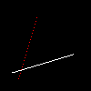

# Brensenham画线算法

现在给定两个点$(x_0,y_0),(x_1,y_1)$，它们可以表示成一条线段：

$\frac{y-y_0}{y_1-y_0}=\frac{x-x_0}{x_1-x_0}$；$y=y_0+\frac{x-x_0}{x_1-x_0}({y_1-y_0})$

所以一条直线可以这样写

```c++
void line(int x0, int y0, int x1, int y1, TGAImage &image, TGAColor color) { 
    for (int x=x0; x<=x1; x++) { 
        float t = (x-x0)/(float)(x1-x0); 
        int y = y0*(1.-t) + y1*t; 
        image.set(x, y, color); 
    } 
}
```

不推了，直接给结论。能这样写有两个前提条件：1.x0<x1；2.直线的斜率小于1，也就是${y_1-y_0}<{x_1-x_0}$
若不满足第一条，for循环会一直进行下去；若不满足第二条，画出来的线有“洞”。就像下面这样



先来解决线有洞的问题。

从代码可以看出每次让x+1，再用x去计算y。因为斜率大于1，所以每次x+1，y加的是个大于1的数(加的是什么在后面)，y一次跳了两个像素，所以中间就会出现洞。
解决办法：当${y_1-y_0}>{x_1-x_0}$时，for循环每次对y+1；反之for循环每次对x+1

但是这样写会导致代码冗余，因为需要写两个for循环。整合到一个for循环的办法是：若${y_1-y_0}>{x_1-x_0}$，swap(x0，y0)；swap(x1，y1)；让这个线段关于y=x翻转。最后我们写像素颜色的时候，再把坐标反过来即可。

再来看 x0>x1的问题，很简单，把两个点交换过来就可以，因为线段无论从哪个方向开始画都一样。

总的代码如下：

```c++
void line(int x0, int y0, int x1, int y1, TGAImage &image, TGAColor color) { 
    bool steep = false; 
    if (std::abs(x0-x1)<std::abs(y0-y1)) { // if the line is steep, we transpose the image 
        std::swap(x0, y0); 
        std::swap(x1, y1); 
        steep = true; 
    } 
    if (x0>x1) { // make it left−to−right 
        std::swap(x0, x1); 
        std::swap(y0, y1); 
    } 
    for (int x=x0; x<=x1; x++) { 
        float t = (x-x0)/(float)(x1-x0); 
        int y = y0*(1.-t) + y1*t; 
        if (steep) { 
            image.set(y, x, color); // if transposed, de−transpose 
        } else { 
            image.set(x, y, color); 
        } 
    } 
}
```

这样的代码效率并不高，原因是有乘除法。我们知道直线的性质：每次$x+1,y+\frac{y_1-y_0}{x_1-x_0}$（自己推）。也就是说y加的是一个固定的数，这个数可以提前算出来，每一个点都可以通过前一个点用加减法计算得到。那得到了一个精确的y，如何确定屏幕上的坐标y‘是保持原样还是+1呢？用error：abs(y-y')来决定！当error大于0.5的时候，y+1；否则不变，error初始值为0，代码如下：

```c++
	int dx = x1-x0; 
    int dy = y1-y0; 
    float derror = std::abs(dy/float(dx)); 
    float error = 0; 
    int y = y0; 
    for (int x=x0; x<=x1; x++) { 
        if (steep) { 
            image.set(y, x, color); 
        } else { 
            image.set(x, y, color); 
        } 
        error += derror; 
        if (error>.5) { 
            y += (y1>y0?1:-1); 
            error -= 1.; 
        } 
    } 
```

现在for循环里已经没有乘除法了，但还有一处可以优化的地方，那就是error和derror都是float类型，能否将其化为int类型进一步加快计算速度呢？答案是可以！

$error=error+derror=error+\frac{dy}{dx}$。两边乘dx可得：$dx*error += {dy}$

后面还有一步判断error>0.5的，两边同乘2。所以上式可变为$2dx*error+=2{dy}$

$error -= 1$改为$2dx*error -= 2dx$

所以我们让

```c++
int derror2 = 2*dy;
```

有代码：

```c++
	int dx = x1-x0; 
    int dy = y1-y0; 
    int derror2 = std::abs(dy)*2; 
    int error2 = 0; 
    int y = y0; 
    for (int x=x0; x<=x1; x++) { 
        if (steep) { 
            image.set(y, x, color); 
        } else { 
            image.set(x, y, color); 
        } 
        error2 += derror2; 
        if (error2 > dx) { 
            y += (y1>y0?1:-1); 
            error2 -= dx*2; 
        } 
    } 
```

这就是bresenham画线算法！

最最最后一个问题！这样画出来的线有锯齿，因为像素有大小且颜色值是非0即1的，怎么给直线抗锯齿呢？答案是用**Wu反走样算法**

# Wu反走样算法

https://blog.csdn.net/m0_56494923/article/details/128516263
