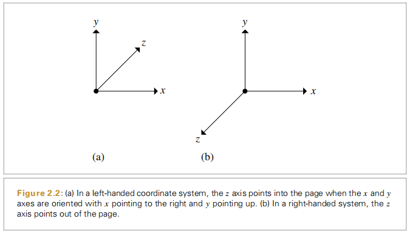

# pbrt场景描述文件

场景文件格式描述地址：[pbrt-v3 Input File Format](https://pbrt.org/fileformat-v3)

```c++
#关键字“LookAt”对应的处理函数是pbrtLookAt(Float ex, Float ey, Float ez, Float lx, Float ly, Float lz,
                Float ux, Float uy, Float uz)；
#ex ey ez lx ly lz ux uy uz  表示camera的pos，look，up向量
LookAt 1 1 10 0 0 -1 0 1 0 
```

```c++
#the camera
#关键字“Camera”对应的处理函数是pbrtCamera(const std::string &name, const ParamSet &params)；
#"属性类型 属性名称" [该名称属性对应的值]
#"perspective"是camera的名称 
Camera "perspective" "float fov" [30]
```

```c++
#void pbrtIntegrator(const std::string &name, const ParamSet &params)
Integrator "mlt" "integer mutationsperpixel" 120000
```

```c++
# 输出的结果文件，"image"是结果文件的类型，这里是图片
# "integer xresolution" "integer yresolution" 设定图片分辨率
# scale  暂时不知含义 
# "string filename" "f11-13.exr" 指定结果图片的文件名，名字是f11-13.exr
# void pbrtFilm(const std::string &type, const ParamSet &params)
Film "image" "integer xresolution" [900] "integer yresolution" [540] "float scale" 3
  "string filename" "f11-13.exr"
```

```c++
#void pbrtRotate(Float angle, Float dx, Float dy, Float dz)
Rotate 90 0 0 1 #旋转角度90°，绕0，0，1旋转
```

```c++
#void pbrtLightSource(const std::string &name, const ParamSet &params)
#"infinite"是光源的类型，在pbrt中有
                    #"point"，"spot"，"goniometric"，"projection"，
                    #"distant"，"infinite"或"exinfinite"这几种光源
#"string mapname" 指的是用图像作为光源 "textures/20060807_wells6_hd.exr"是该图像的路径
#光源类型不同，指定的参数也不同
#scale 暂时不知含义              
LightSource "infinite" "string mapname"
    "textures/20060807_wells6_hd.exr"   "color scale" [2.5 2.5 2.5]
```

```c++
#void pbrtMaterial(const std::string &name, const ParamSet &params)
#"matte"指的是材质的类型，在pbrt中有               
                    #"matte"，"plastic"，"translucent"，"glass"，"mirror"，
                    #"hair"，"disney"，"mix"，"metal"，"substrate"，"uber"，
                    #"subsurface"，"kdsubsurface"，"fourier"这几种类型的材质
Material "matte" "color Kd" [.1 .1 .1]
```

```c++
#平移：x,y,z上的平移分量
Translate 0 0 -40
```

# pbrt坐标系

pbrt使用的是左手系

