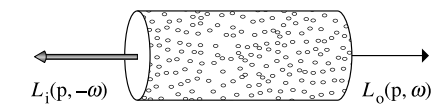
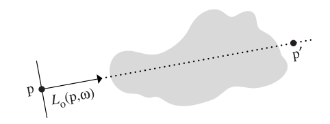
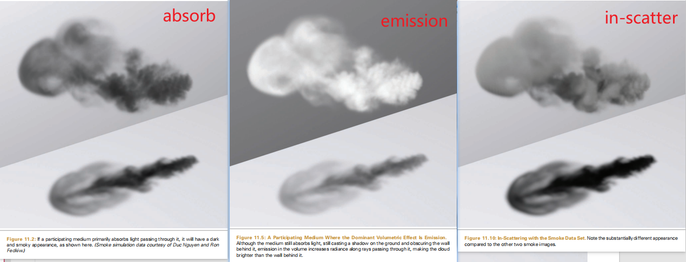
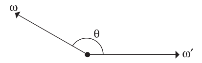
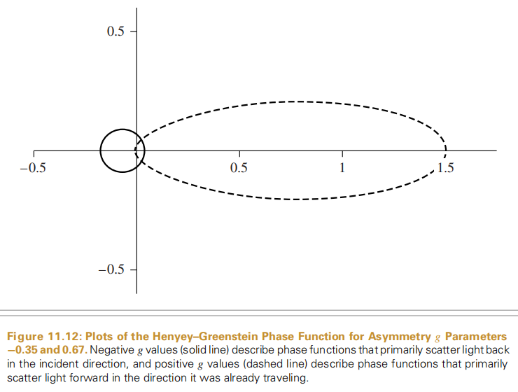
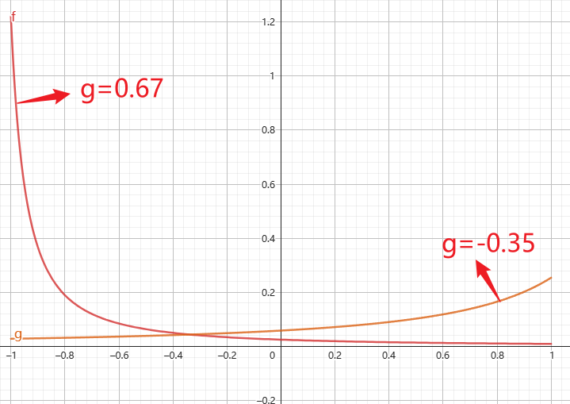

# pbrt.ch11_VOLUME SCATTERING

本章整体脉络：

1. 描述光穿过participate media的物理过程
2. 介绍Medium这个基类，这个基类是用来描述participate media的
3.  介绍Integrators，细节描述是在第15章

问题：这个基类是干嘛的？？为什么需要Integrators？？

## 光穿过participate media的物理过程

包括3个方面

1. absorption：光线与介质中的粒子碰撞，直接将光能转换成其它形式的能量，例如热能，因此光线的辐射率被衰减了；
2. emissions：介质中的发光粒子产生的辐射率附加到光线上，因此光线的辐射率被增强了；
3. scatter：光线与介质中的粒子碰撞，导致光线的传播方向发生了变化，对于给定的传播方向，既有该方向上的光线向外散射到其他方向（外散射），又有其他方向的光线被散射并融入到该方向上（内散射）。

这些体积散射效应按照介质的类别又可以分为均匀（homogeneous）散射和非均匀（inhomogeneous）散射。均匀散射指参与介质在其分布的空间中是均匀分布的（可以看成参与介质的粒子是均匀散落在空间中），此类介质的散射比较简单；非均匀散射则是指光线在非均匀分布的参与介质中传播，例如地球的大气层，从海平面逐渐升高空气的密度逐渐稀薄。

我们先不考虑emissions，因为牙齿的粒子不会发射光线。另外，牙釉质和牙本质在空间中的分布是均匀的。

### absorption

阳光照射到空气中的烟雾，也会在地面上投射出一个阴影轮廓，这是因为光线经过烟雾介质时一部分的radiance被吸收了，导致到达地面上的辐射率低了不少，从而形成阴影。烟雾越浓越厚，则阴影越明显。

吸收由介质的吸收截面$\sigma_a$来描述，它描述了光透过介质中的单位距离时被吸收的分量，因此这是一个概率密度函数，单位为距离的倒数。一般来说，吸收截面可以随位置$p$和方向$\omega$的变化而变化，但是吸收截面通常是之关于位置的函数。通常它也是随频谱变化的量，意思就是$\sigma_a$有3个分量分别代表rgb波长下的吸收系数。值得注意的是，虽然$\sigma_a$是概率密度，但它的取值并没有被限制于0到1之间，因此需要进一步取自然底数e的指数转换成吸收概率密度值（后面会看到）。

下图展示了光线在介质中经过的一段极短的距离（以$p$点为中心）被吸收的情况，设该极短距离为$dt$。光线从左边入射进来，其辐射率为$L_i(p,-\omega)$，与介质中的粒子碰撞被吸收之后的出射辐射率记为$L_o(p,\omega)$。现给定吸收截面$\sigma_a$，则被吸收的微分辐射率为：


$$
L_o(p,\omega)-L_i(p,-\omega)=dL_o(p,\omega)=-\sigma_a(p,\omega)L_i(p,-\omega)dt
$$
上式给出了光线被吸收的辐射率值，它表明被吸收的微分辐射率$dL_o$是其初始辐射率$L_i$的线性函数。

因此，给定光线的起始点$p$和入射方向$\omega$，光线在介质中穿过$d$距离时，经过吸收衰减之后，剩余的辐射率占据原来的辐射率比值为如下的指数上的积分形式：
$$
e^{-\int_0^d\sigma_a(p+t\omega,\omega)dt}
$$
即对$[0,d]$上的吸收截面$\sigma_a$进行积分，得到总的吸收率，再取负就得到剩余的能量比例。

### scatter

当射线通过介质时，它会与粒子碰撞并向不同方向散射。散射分为内散射和外散射，外散射指的是沿着$\omega$方向传播的光与粒子碰撞之后沿着$\omega'$方向传播，结果是$\omega$方向的radiance被减少；内散射指的是沿着其它方向$\omega'$传播的光与粒子碰撞之后沿着$\omega$方向传播，结果是$\omega$方向的radiance被增加。

#### out-scatter

散射系数$\sigma_s$指的是在**单位距离**内发生外散射的概率。同吸收一样，外散射导致的减少的微分辐射率为：
$$
dL_o(p,\omega)=-\sigma_s(p,\omega)L_i(p,-\omega)dt
$$
通常，对于辐射率的衰减，我们把吸收和外散射两个因素综合起来一起计算，因此总的衰减比例为吸收截面加上散射系数：$\sigma_t(p,\omega)=\sigma_s(p,\omega)+\sigma_a(p,\omega)$，这个系数称为衰减系数或者消光系数

这里有两个非常重要的与衰减系数相关的概念。一个是参与介质的**反照率**（albedo），其公式为$\rho=\frac{\sigma_s}{\sigma_t}$，取值范围是$[0,1]$，表示了散射概率在衰减概率中的比例；另一个是**平均自由路径**（*mean free path*），公式为$\frac{1}{\sigma_t}$，指的是radiance和粒子相互作用之前在介质中传输的平均距离。

给定系数$\sigma_t$，辐射率的衰减速率为
$$
\frac{dL_o(p,\omega)}{dt}=-\sigma_s(p,\omega)L_i(p,-\omega)
$$
给定要通过的路径的两个端点$p$和$p'$（如下图所示），下面的积分公式计算的是计算光线通过这条路径时，除去被吸收和被外散射的，剩余的radiance的占比，这个积分被称之为**光束透射率**（*beam transmittance*）：
$$
T_r(p\rightarrow p')=e^{-\int_0^d\sigma_t(p+t\omega,\omega)dt}
$$
其中$d=\Vert p-p' \Vert$，$\omega$是$p\rightarrow p$的单位方向向量。



$T_r$是介于0，1之间的，本质上是个百分比，因为$\sigma_t>0$，所以积分部分$\int_0^d\sigma_t(p+t\omega,\omega)dt>0$，根据$e^{-x}$的函数图像可以轻易得出这个结论。所以，经过衰减后到达$p'$点的radiance就是起始点$p$的radiance再乘上*beam transmittance*：
$$
T_r(p\rightarrow p')L_o(p,\omega)
$$
 *beam transmittance*有以下性质：

1. $T_r(p\rightarrow p)=1$
2. 真空中$\sigma_t=0$，所以对于真空环境任何一个点$p'$，$T_r(p\rightarrow p')=1$
3. 若$\sigma_t$满足：$\sigma_t(\omega)=\sigma_t(-\omega)$或$\sigma_t$与方向$\omega$无关，那么$T_r$有自反性$T_r(p\rightarrow p')=T_r(p'\rightarrow p)$
4. $T_r(p\rightarrow p'')=T_r(p\rightarrow p')*T_r(p'\rightarrow p'')$

第4条在计算空间中的散射情况非常有用。

另外，$T_r$的积分部分$\int_0^d\sigma_t(p+t\omega,\omega)dt$被称为两点之间的**光学厚度**（ *optical thickness*），用符号$\tau$来表示，求解*beam transmittance*的关键就在于求解*optical thickness*。对于均匀的介质，$\sigma_t$是个常数，所以$\tau=\sigma_td$，从而得出了Beer定律的光束透射率公式：$T_r(p\rightarrow p')=e^{-\sigma_td}$

#### in-scatter

in-scatter导致的结果是$\omega$方向radiance增加。从烟雾渲染效果来看，in-scatter占主导地位时烟雾看起来更厚了一点。



对于内散射，这里做了一个假设，即介质粒子之间的间隔是粒子半径的数倍（即互不接触），因此在描述散射性质时可以忽略粒子之间的交互作用。基于该假设，给定空间中的一点和光线传播方向$\omega$以及另外一个不同的方向$\omega'$，**相位函数**（phase function）$phase(\omega,\omega')$描述了从$\omega'$方向上的光线被散射到$\omega$方向的**概率密度**值，类似于BSDF函数。因此相位函数有如下的**归一化**约束：
$$
\int_{H^2}phase(\omega,\omega')d\omega'=1
$$
不考虑emissions项，由in-scatter带来的radianec的增加可以写为：
$$
L_s(p,\omega)=\sigma_s(p,\omega)\int_{H^2}phase(p,\omega,\omega_i)L_i(p,\omega_i)d\omega_i
$$
$\sigma_s$表示介质在单位距离发生散射的概率，积分部分的意思是p点的radiance增加的量，它是个在半球上的积分。很好理解了就不赘述了。

所以通过内散射和发光增加的微分辐射率为：
$$
dL_o(p,\omega)=L_s(p,\omega)dt
$$
考虑吸收、内散射和外散射，单位距离内辐射度的变化率可以写成：


## 相位函数

BSDF模型对于给定的入射方向和出射方向，计算出射辐射率占入射辐照度的比值。在体积散射中，相位函数也是一个类似的模型。同BSDF一样相位函数也有很多种，针对不同的材质，它们往往不太一样。在相位函数中，有些是通过拟合得到的参数化模型(parameterized models)，有些是根据介质形状和材质的散射辐射率分布推导出的解析模型(analytic models)。

对于大部分的自然介质，其相位函数是关于$\theta$的一维函数，入射方向$\theta$是$\omega_i$和出射方向$\omega_o$的夹角，这些相位函数通常记为$p(\cos\theta)$。此类相位函数对应的参与介质是各向同性的，具有关于入射方向的局部旋转不变性。此外，因为$\cos(-\theta)=\cos(\theta)$，故该**各向同性介质的相位函数具有可逆性**，即$\omega_i$和$\omega_o$交换，但相位函数取值不变。对于各向异性的介质，其相位函数通常是关于$\omega_i$和$\omega_o$的四维函数，比较复杂。

这里需要注意的一点就是，相位函数本身亦可以是各向同性或者各向同性的，因此各向同性的介质可以有一个各向异性的相位函数。一个各向同性的相位函数描述的是向所有方向均等散射的情况，因此与$\omega_i$和$\omega_o$这两个方向无关，各向同性的相位函数只有如下面的一个：
$$
p(\omega_o,\omega_i)=\frac{1}{4\pi}
$$
$\omega_o$是原本的光线传播方向，$\omega_i$是从其他方向弹射过来的入射方向。在pbrt中有一个`PhaseFunction`的接口类如下，其中`p(const Vector3f &wo, const Vector3f &wi)`就是相位函数的接口，它的输入参数为$\omega_i$和$\omega_o$：

```c++
class PhaseFunction {
  public:
    // PhaseFunction Interface
    virtual ~PhaseFunction();
    virtual Float p(const Vector3f &wo, const Vector3f &wi) const = 0;
    virtual Float Sample_p(const Vector3f &wo, Vector3f *wi,const Point2f &u) const = 0;
};
```

给定$\omega_i$和$\omega_o$，p()返回phase function的值。

pbrt中phase function遵守惯例：**入射方向和出射方向都指向远离散射发生的点**。这和之前讲诉scatter的惯例不同，入射方向和出射方向的夹角用$\theta$来表示，如下图所示：



Henyey和Greenstein提出一个现今广泛使用的相位函数，这个相位函数是专门设计用来拟合散射数据的。该相位函数的输入参数除了$\cos\theta$之外，还有非对称参数$g$，控制了光的散射分布。但应用到某个参与介质上时，非对称参数$g$就固定了：
$$
p_{HG}(\cos\theta)=\frac{1}{4\pi}\frac{1-g^2}{(1+g^2+2g(\cos\theta))^{3/2}}
$$
非对称参数$g$的取值范围为$[-1,1]$，$g$的不同取值则对应的相位函数分布亦不相同。下图分别展示了$g=-0.35$（实线）和$g=0.67$（虚线）时的Henyey-Greenstein相位函数分布。$g$取$[-1,0]$时光线大部分都从后半球方向散射进来（原文： light is mostly scattered back toward the incident direction），称之为后向散射（back-scattering）；$g$取$[0,1]$时光线大部分都从前半球方向散射进来（原文： primarily scatter light forward in the direction it was already traveling.），称之为前向散射（forward-scattering）。$g$的绝对值越大，则越偏向于$\omega$（对于前向散射）或者$-\omega$（对于后向散射）方向。



画出HG相位函数的图像，x轴代表$\cos\theta$的值，y轴代表相位函数的结果。当$g=0.67$和$g=-0.35$的时候函数图像如下所示：



有一个问题，为什么g=0.67、$\cos\theta$接近-1时，相位函数的值会大于1？？？相位函数不是指的概率吗？

$\cos\theta>0,\frac{\pi}{2}<\theta<\frac{3}{2}\pi$   

$\cos\theta<0,0<\theta<\frac{\pi}{2},\frac{3}{2}\pi<\theta<2\pi$

前向散射和后向散射产生的视觉效果差别非常大，下图给出了两者的渲染结果。左边的是后向散射的结果（$g=-0.7$），因此可以模型后面的光线透过模型，抵达人眼，产生透射效果；右边的是前向散射的结果（$g=0.7$），模型倾向于反射其前方的光线，产生反射效果。


可以实现Henyey-Greenstein相位函数如下：

```c++
inline Float PhaseHG(Float cosTheta, Float g) {
    Float denom = 1 + g * g + 2 * g * cosTheta;
    return Inv4Pi * (1 - g * g) / (denom * std::sqrt(denom));
}

class HenyeyGreenstein : public PhaseFunction {
  public:
    // HenyeyGreenstein Public Methods
    HenyeyGreenstein(Float g) : g(g) {}
    Float p(const Vector3f &wo, const Vector3f &wi) const;
    Float Sample_p(const Vector3f &wo, Vector3f *wi,
                   const Point2f &sample) const;
  private:
    const Float g;
};

Float HenyeyGreenstein::p(const Vector3f &wo, const Vector3f &wi) const {
    ProfilePhase _(Prof::PhaseFuncEvaluation);
    return PhaseHG(Dot(wo, wi), g);
}
```

Henyey-Greenstein模型中的非对称参数$g$实际上有明确的数学意义，是相位函数$p$分布下的$\cos\theta$值的数学期望（或者说平均值），这里相位函数是概率密度函数，即：
$$
g=\int_{S^2}p(-\omega,\omega)(\omega·\omega')d\omega'=2\pi\int_0^\pi p(-\cos\theta)cos\theta\sin\theta d\theta
$$
对于各向同性的相位函数$p=\frac{1}{4\pi}$，可计算得到$g=0$，符合预期。更复杂的相位函数可以通过一些简单的相位函数（比如H-G相位函数）加权叠加得到：
$$
p(\omega,\omega')=\sum_{i=1}^n\omega_ip_i(\omega\rightarrow \omega')
$$
权重和$\sum_{i=1}^n\omega_i$应该等于1，确保相位函数的归一化性质。pbrt并没有实现该类相位函数。


## 参与介质


## 今天的任务：简略的复习一下微分方程

任务搁浅，因为好像暂时用不到