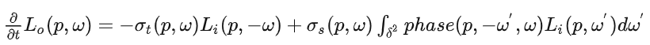
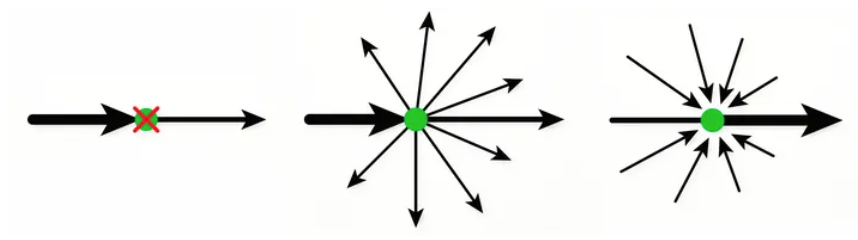
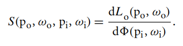
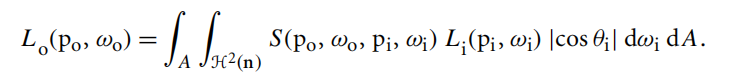

# 次表面散射

### Participating Media

画ground truth，最简单，最精确，也是计算量最大，最慢的方法，就是直接在物体内部的空间求解带有Participating Media的渲染方程。这里简单介绍一下Participating Media的数学定义，想详细了解可以参考**pbrt第11章**

Participlating Media的存在，意味着传统的渲染方程不再是传统的以场景中所有表面为定义域的积分，因为光线在有介质的空间中传播的时候，不用和表面接触，也会被空间中的介质所吸收，散射。通常我们用一下几个参数来描述空间中介质的性质。吸收系数$\sigma_a$，和散射系数$\sigma_s$。前者描述了空间中每单位长度中光子被吸收的概率，后者则描述了每单位长度中光子被散射、既传播方向被改变的概率。散射系数包括了其他方向的光线入射到当然方向的概率，也包括当前方向出射到其他方向的概率。另一个参数是$\sigma_t$=$\sigma_a$+$\sigma_s$，就是衰减系数，它是吸收系数和散射系数的和，代表了单位距离内光子出射到其他方向或者被吸收掉的总概率。所以单位距离内辐射度的变化率可以写成：

第一眼看去貌似有些吓人，实际上说的就是，在介质中，单位长度上Radiance强度的变化会因为被介质吸收而减少，同时一部分能量会随机向外散射出去，最后来自各个其他方向的光线也有一定概率散射到当前方向。其中方程最右边积分中的$phase$是phase function，可以理解成空间中的BSDF，定义了空间中一点两个方向间发生散射的概率。另一个值得一提的是，每个频率的光线都有对应的系数。也就是说在用RGB渲染时，每个颜色都要有各自的吸收和散射系数。

渲染Participating Media的方法有很多，例如最简单的Volumetric Path Tracing，Volumetric Photon Mapping等等。两个参考， [http://www.http://cs.cornell.edu/courses/cs6630/2012sp/notes/09volpath.pdf](https://link.zhihu.com/?target=http%3A//www.cs.cornell.edu/courses/cs6630/2012sp/notes/09volpath.pdf)是最简单的Volumetric Path Tracing的tutorial；https://cgg.mff.cuni.cz/~jaroslav/papers/2014-upbp/2014-upbp-paper.pdf是State of the art的Participating media estimator。因为话题很大，这里不再展开，以后有时间会再专门写写相关的内容。

### BSSRDF

问题：分母$\phi=\frac{dQ}{dt}$，为什么和$p_i,\omega_i$相关？？

BSSRDF的积分形式如下，由于出射点和入射点不一样，所以要对面积积分。

**$p_i,p_o$的距离增加，S会减少**

物体表面下的light transport一方面由传输方程(the equation of transfer)来描述，另一方面它和参与介质中光的传输有相同的principle。所以物体的次表面散射与光在烟雾或者云中的散射有相同的effect，只是scale小一点罢了。

### **VOLUME SCATTERING PROCESSES**

影响光在参与介质中交互的主要过程有3个

1. 吸收：光能转化为其它能量，从而导致radiance减少
2. emission：发光粒子将radiance 发射到环境中
3. 散射：radiance撞击到粒子之后，改变运动方向

所有的这些特征可能是homogeneous或者inhomogeneous的。homogeneous的意思是光在穿过指定区域之后不会改变的特性。反之inhomogeneous的意思是会被改变的特性。

#### 百度文库对吸收截面和吸收系数的解释：

吸收截面又称为吸收概率，吸收截面是指**单位面积**内物质对radiance吸收的能力，计算方法是假设辐射入射到物质上的面积为A，物质辐射的吸收率为$\alpha$，则物质对radiance的吸收截面为$\sigma=\alpha A$。吸收截面的大小与物质的性质、辐射的能量、入射角度等因素有关！一般来说，吸收截面随着辐射能量的增加而增加。

吸收系数是指**单位长度**内物质对radiance吸收的能力，其计算方法是假设辐射入射到物质上的irradiance为$J$，物质的厚度为$d$，则物质对radiance的吸收系数为$\mu=\ln(\frac{J_0}{J})/d$，其中$J_0$为入射的irradiance。吸收系数的大小与物质的性质、辐射的能量、入射角度、厚度等因素有关。一般来说，吸收系数随着辐射能量的增加而减小。

吸收截面与吸收系数之间的换算关系：

吸收截面和吸收系数是描述物质对辐射吸收能力的两个不同的量度。它们之间存在一定的换算关系，可以通过下面的公式进行换算：

$\sigma=\frac{\mu}{\rho}$

其中$\rho$为物质的密度。这个公式的意义是，单位体积内物质对辐射的吸收截面等于单位长度内物质对辐射的吸收系数除以物质的密度。需要注意的是，这个公式只适用于均匀物质。对于非均匀物质，吸收截面和吸收系数的换算关系可能会有所不同。

#### PBRT对吸收截面的解释：

吸收截面指的是光传输单位距离被吸收的概率密度。原文：**Absorption is described by the medium’s *absorption cross section*, $\sigma _a$, which is the probability density that light is absorbed per unit distance traveled in the medium.**

感觉和百度文库的解释不一样？？？？

#### wiki百科对吸收截面和吸收系数的解释：

截面：用来量化某种radiance（可以是粒子束，X-ray，声波）和物质相互作用的时候发生某种特定现象的**概率**。光也是粒子束。

所以吸收截面指的是光和分子相互作用的时候**光被吸收的概率**。吸收截面的单位是$cm^{2}·molecule^{-1}$，看不懂这个单位。单位的前半部分是面积，但并不是指实际大小的面积，部分原因是分子的密度或状态会影响吸收截面。后半部分是分子，难道意思是光和1个分子作用后被吸收的概率？？

吸收系数：