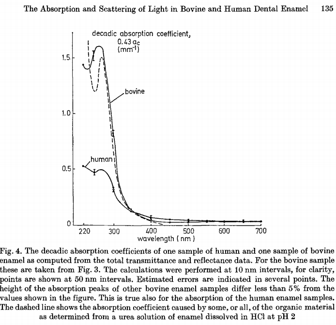
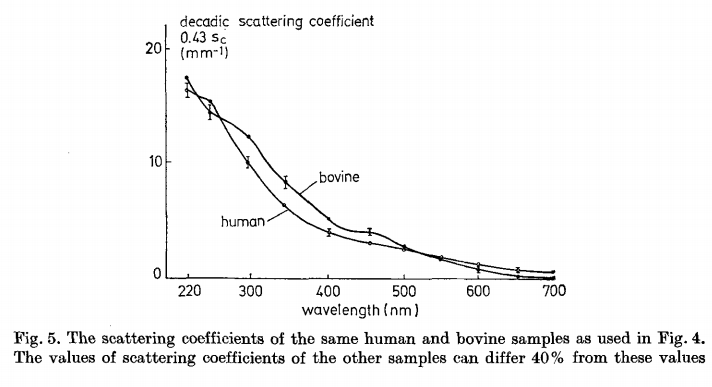
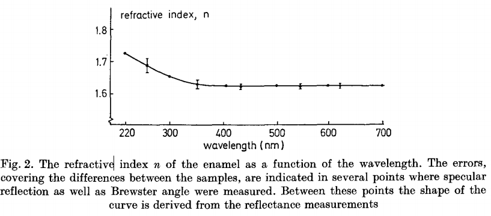
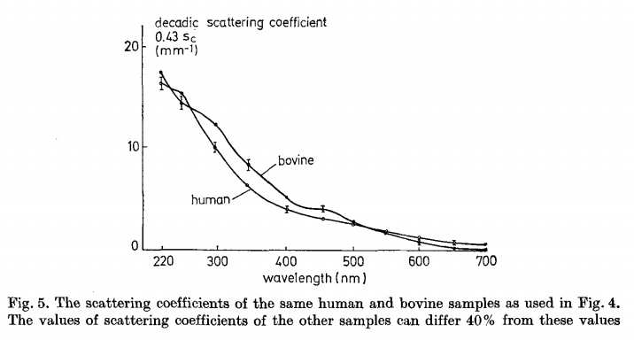

# 牙釉质光学特性

正常牙釉质的厚度为2-2.5mm

芳香族氨基酸，是牙釉质里的有机成分，负责了几乎全部的能观察到的光谱吸收。这个有机物影响了牙釉质的颜色。牙釉质的主要成分：羟基磷灰石。吸收系数指的是单位厚度时的吸收度，研究牙釉质以mm为单位，吸收度=$\log\frac{入射光强}{透射光强}$

牛的牙釉质和人的牙釉质 误差都小于5%。虚线表示溶解在盐酸中的牙釉质的有机物的吸收系数。

不同的人牙釉质的折射率没有显著差异。牙釉质也没发现明显的各向异性。羟基磷灰石的折射率和牙釉质的折射率基本一致。下面是牙釉质折射率和波长的关系

可见光的波长范围是400-760nm，可见这个区间误差范围已经很小了。

